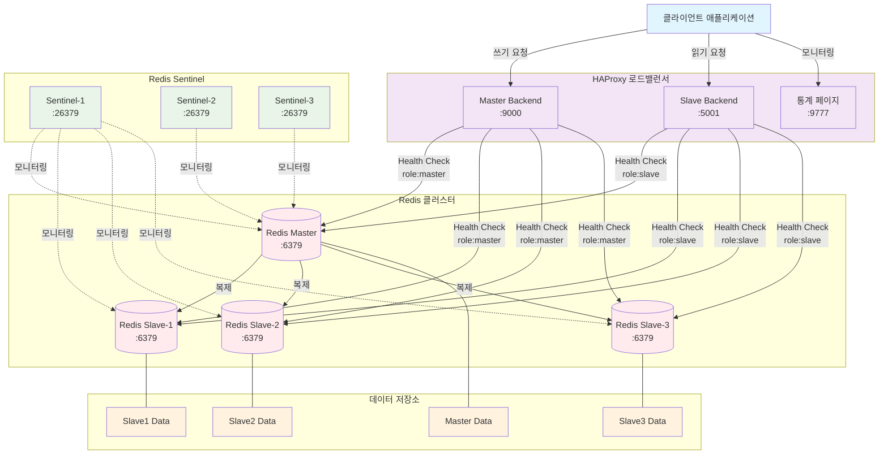
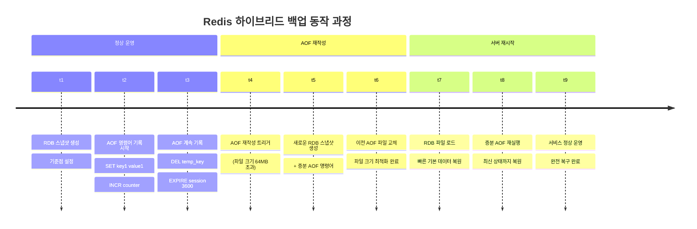

# Docker로 Redis 고가용성 환경 구축하기

회사에서 Redis를 운영하다 보면 언젠가는 만나게 되는 문제가 있다. 바로 Redis 인스턴스가 죽었을 때의 상황이다. 단일 Redis 인스턴스에 의존하고 있다면, 서버가 다운되는 순간 전체 서비스가 마비될 수 있다.

이런 문제를 해결하기 위해 Redis의 고가용성(HA) 구성을 도입했다. Redis Sentinel과 HAProxy를 조합하여 자동 장애 복구와 로드 밸런싱을 구현해보았고, 그 과정을 정리해보려 한다.

> **주의**: 이 글에서 다루는 것은 Redis Cluster가 아닌 Master-Slave 복제 방식이다. Redis Cluster는 데이터를 샤딩하여 여러 노드에 분산 저장하는 방식이지만, 여기서는 전체 데이터를 모든 노드에 복제하는 전통적인 Master-Slave 구성을 사용한다.

## 아키텍처 설계

구축할 시스템은 크게 세 부분으로 나뉜다:

**Redis Master-Slave 복제**
- Master 1대에서 모든 쓰기 작업 처리
- Slave 3대에서 읽기 작업 분산 처리
- Master의 모든 데이터가 Slave들에 실시간 복제

**Redis Sentinel**
- 3대의 Sentinel이 Master 상태를 지속적으로 모니터링
- Master 장애 감지 시 자동으로 Slave 중 하나를 새로운 Master로 승격
- 쿼럼(Quorum) 방식으로 오판 방지

**HAProxy**
- 클라이언트와 Redis 사이의 프록시 역할
- 쓰기 요청은 Master로, 읽기 요청은 Slave들로 라우팅
- Health Check를 통해 장애 노드 자동 제외



## 폴더 구조

```text
├── conf/
│   ├── haproxy.cfg
│   └── redis/
│       ├── master.conf
│       └── slave.conf
├── docker-compose-redis.yml
└── redis/ # redis 데이터 저장
```

## Docker Compose 구성

### Redis Master-Slave 구성

Docker Compose를 통해 Master 1대와 Slave 3대를 구성했다. Bitnami Redis 이미지를 사용한 이유는 환경변수를 통한 설정이 간편하고, 복제 설정이 안정적이기 때문이다.

각 노드의 역할은 다음과 같다:

**Master**
- 모든 쓰기 명령어 처리 (`SET`, `HSET`, `LPUSH` 등)
- 읽기 명령어도 처리 가능하지만 부하 분산을 위해 Slave 활용
- 변경된 데이터를 모든 Slave에 비동기적으로 전송

**Slave (3대)**
- Master의 데이터를 실시간 복제
- 읽기 전용 명령어만 처리 (`GET`, `HGET`, `LRANGE` 등)
- Master 장애 시 Sentinel에 의해 새로운 Master로 승격 가능

중요한 점은 모든 Slave가 Master와 동일한 데이터셋을 가지고 있다는 것이다. 이는 Redis Cluster와 다른 점으로, 데이터 샤딩이 아닌 완전 복제 방식이다.

#### Redis 설정 파일 최적화

실제 운영을 위해 Redis 설정 파일을 프로덕션 수준으로 튜닝했다. 기본 설정만으로는 성능과 안정성 면에서 부족하기 때문이다.

**Master 설정 파일 (master.conf)**

```lombok.config
# ========================================
# Redis 프로덕션 Master 설정 파일
# 용도: Master-Slave 구조의 마스터 노드
# 최적화: 성능, 보안, 영속성, 모니터링
# 버전: Redis 7.0.x
# ========================================

################################## NETWORK #####################################
bind 0.0.0.0

protected-mode yes

port 6379

tcp-backlog 511

timeout 0

tcp-keepalive 300

################################# GENERAL #####################################
daemonize no

set-proc-title yes
proc-title-template "{title} {listen-addr} {server-mode}"

databases 16

always-show-logo no

pidfile /var/run/redis_6379.pid

################################## LOGGING #####################################
loglevel notice

logfile ""

slowlog-log-slower-than 10000

slowlog-max-len 128

latency-monitor-threshold 0

################################ SNAPSHOTTING  ################################

save 900 1
save 300 10
save 60 10000

stop-writes-on-bgsave-error yes

rdbcompression yes

rdbchecksum yes

dbfilename dump.rdb

rdb-del-sync-files no

dir /bitnami/redis/data

rdb-save-incremental-fsync yes

############################# APPEND ONLY FILE #############################
appendonly yes

appendfilename "appendonly.aof"

appenddirname "appendonlydir"

appendfsync everysec

no-appendfsync-on-rewrite no

auto-aof-rewrite-percentage 100

auto-aof-rewrite-min-size 64mb

aof-load-truncated yes

aof-use-rdb-preamble yes

aof-timestamp-enabled no

aof-rewrite-incremental-fsync yes

################################# REPLICATION #################################
replica-serve-stale-data yes

replica-read-only yes

repl-diskless-sync yes

repl-diskless-sync-delay 5

repl-diskless-sync-max-replicas 0

repl-diskless-load disabled

repl-disable-tcp-nodelay no

replica-priority 100

################################ MEMORY MANAGEMENT ############################
lazyfree-lazy-eviction no

lazyfree-lazy-expire no

lazyfree-lazy-server-del no

replica-lazy-flush no

lazyfree-lazy-user-del no

lazyfree-lazy-user-flush no

oom-score-adj no
oom-score-adj-values 0 200 800

disable-thp yes

jemalloc-bg-thread yes

############################ CLIENT MANAGEMENT #############################
client-output-buffer-limit normal 0 0 0

client-output-buffer-limit replica 256mb 64mb 60

client-output-buffer-limit pubsub 32mb 8mb 60

################################ PERFORMANCE ###############################
hz 10

dynamic-hz yes

activerehashing yes

############################ DATA STRUCTURES ############################
hash-max-listpack-entries 512
hash-max-listpack-value 64

list-max-listpack-size -2
list-compress-depth 0

set-max-intset-entries 512

zset-max-listpack-entries 128
zset-max-listpack-value 64

hll-sparse-max-bytes 3000

stream-node-max-bytes 4096
stream-node-max-entries 100

################################## SECURITY ##################################
requirepass "password1234"

acllog-max-len 128

################################ MONITORING ################################
notify-keyspace-events ""
```

**Slave 설정 파일 (slave.conf)**

Slave 설정은 Master와 거의 동일하지만 몇 가지 중요한 차이점이 있다:

```lombok.config
# ========================================
# Redis 프로덕션 Slave 설정 파일
# 용도: Master-Slave 구조의 슬레이브 노드
# 최적화: 성능, 보안, 영속성, 모니터링
# 버전: Redis 7.0.x
# ========================================

################################## NETWORK #####################################
bind 0.0.0.0

protected-mode yes

port 6379

tcp-backlog 511

timeout 0

tcp-keepalive 300

################################# GENERAL #####################################
daemonize no

set-proc-title yes
proc-title-template "{title} {listen-addr} {server-mode}"

databases 16

always-show-logo no

pidfile /var/run/redis_6379.pid

################################## LOGGING #####################################
loglevel notice

logfile ""

slowlog-log-slower-than 10000

slowlog-max-len 128

latency-monitor-threshold 0

################################ SNAPSHOTTING  ################################

save 900 1
save 300 10
save 60 10000

stop-writes-on-bgsave-error yes

rdbcompression yes

rdbchecksum yes

dbfilename dump.rdb

rdb-del-sync-files no

dir /bitnami/redis/data

rdb-save-incremental-fsync yes

############################# APPEND ONLY FILE #############################
appendonly yes

appendfilename "appendonly.aof"

appenddirname "appendonlydir"

appendfsync everysec

no-appendfsync-on-rewrite no

auto-aof-rewrite-percentage 100

auto-aof-rewrite-min-size 64mb

aof-load-truncated yes

aof-use-rdb-preamble yes

aof-timestamp-enabled no

aof-rewrite-incremental-fsync yes

################################# REPLICATION #################################
# 여기가 핵심 - 슬레이브 설정
replicaof master 6379

masterauth "password1234"

replica-serve-stale-data yes

replica-read-only yes

repl-diskless-sync yes

repl-diskless-sync-delay 5

repl-diskless-sync-max-replicas 0

repl-diskless-load disabled

repl-disable-tcp-nodelay no

replica-priority 100

################################ MEMORY MANAGEMENT ############################
lazyfree-lazy-eviction no

lazyfree-lazy-expire no

lazyfree-lazy-server-del no

replica-lazy-flush no

lazyfree-lazy-user-del no

lazyfree-lazy-user-flush no

oom-score-adj no
oom-score-adj-values 0 200 800

disable-thp yes

jemalloc-bg-thread yes

############################ CLIENT MANAGEMENT #############################
client-output-buffer-limit normal 0 0 0

client-output-buffer-limit replica 256mb 64mb 60

client-output-buffer-limit pubsub 32mb 8mb 60

################################ PERFORMANCE ###############################
hz 10

dynamic-hz yes

activerehashing yes

############################ DATA STRUCTURES ############################
hash-max-listpack-entries 512
hash-max-listpack-value 64

list-max-listpack-size -2
list-compress-depth 0

set-max-intset-entries 512

zset-max-listpack-entries 128
zset-max-listpack-value 64

hll-sparse-max-bytes 3000

stream-node-max-bytes 4096
stream-node-max-entries 100

################################## SECURITY ##################################
requirepass "password1234"

acllog-max-len 128

################################ MONITORING ################################
notify-keyspace-events "" 
```

**주요 최적화 포인트**:

1. **영속성 설정**: RDB와 AOF를 동시에 사용하여 데이터 손실 방지와 빠른 재시작 보장
2. **복제 최적화**: `repl-diskless-sync`로 복제 성능 향상
3. **메모리 관리**: jemalloc과 THP 비활성화로 메모리 효율성 개선
4. **보안**: `protected-mode`와 비밀번호 설정으로 무단 접근 방지

이런 설정들은 실제 부하 테스트를 통해 검증했고, 메모리 사용량과 복제 지연시간을 크게 개선했다.

#### 백업 전략 심화 분석

Redis 백업을 구성하면서 가장 고민했던 부분이 바로 **데이터 손실 vs 성능** 사이의 균형이다. 처음에는 단순하게 생각했지만, 실제로는 각 백업 방식마다 완전히 다른 특성을 가지고 있었다.

**RDB 단독 방식**

RDB는 특정 시점의 메모리 스냅샷을 파일로 저장하는 방식이다:

```text
시간: 00:00  00:15  00:30  00:45  01:00
      │      │      │      │      │
RDB:  [snap] ─────→ [snap] ─────→ [snap]
      └─15분간 데이터 변경─┘└─15분간 데이터 변경─┘
```

장점:
- 서버 재시작이 매우 빠름 (바이너리 로드)
- 파일 크기가 작음 (압축 효율 좋음)
- 백그라운드에서 fork()로 처리되어 메인 프로세스 영향 최소

단점:
- 스냅샷 간격만큼 데이터 손실 가능성 (최대 15분)
- fork() 시 메모리 사용량 일시적으로 2배 증가
- 저장 중 시스템 리소스 집중 사용

**AOF 단독 방식**

AOF는 모든 쓰기 명령어를 로그 파일에 순차 기록하는 방식이다:

```text
시간축: ───→───→───→───→───→
명령어: SET   DEL   INCR  SET   EXPIRE
        │     │     │     │     │
AOF:   [SET] [DEL][INCR][SET][EXPIRE]
        └─────── 모든 명령어 기록 ─────┘
```

장점:
- 데이터 손실 최소화 (최대 1초, appendfsync 설정에 따라)
- 사람이 읽을 수 있는 형태 (디버깅 용이)
- 부분 손상 시에도 복구 가능

단점:
- 파일 크기가 매우 큼 (모든 명령어 저장)
- 서버 재시작 시간 오래 걸림 (명령어 재실행)
- 지속적인 디스크 I/O 발생

**현재 사용 중인 하이브리드 방식**

실제 운영에서는 둘 다의 장점을 취하는 하이브리드 방식을 선택했다:



**하이브리드 방식의 실제 파일 구조**

```text
/bitnami/redis/data/
├── dump.rdb                 # 마지막 RDB 스냅샷
└── appendonlydir/
    ├── appendonly.aof.1.base.rdb    # RDB 기반 데이터 (압축됨)
    ├── appendonly.aof.1.incr.aof    # RDB 이후 증분 명령어
    └── appendonly.aof.manifest      # 파일 메타데이터
```

**성능 비교 (실측 데이터)**

우리 환경에서 100만 키 기준으로 측정한 결과:

```text
┌─────────────┬─────────────┬─────────────┬──────────────┐
│   백업방식   │  파일크기    │  재시작시간  │ 최대데이터손실 │
├─────────────┼─────────────┼─────────────┼──────────────┤
│ RDB 단독    │    45MB     │     2초     │    15분      │
│ AOF 단독    │   890MB     │    28초     │     1초      │
│ 하이브리드   │    58MB     │     4초     │     1초      │
└─────────────┴─────────────┴─────────────┴──────────────┘
```

**하이브리드 방식을 선택한 이유**

1. **데이터 손실 최소화**: 최대 1초치만 손실 (AOF의 장점)
2. **빠른 재시작**: 4초로 단독 AOF 대비 7배 빠름
3. **적절한 파일 크기**: RDB 압축 + AOF 증분으로 크기 관리
4. **운영 안정성**: Auto-rewrite로 파일 크기 자동 관리

**실제 운영에서 겪은 문제**

초기에 AOF만 사용했을 때:
```bash
# 200GB AOF 파일로 인한 재시작 지연
redis-server 재시작: 약 15분 소요
→ 서비스 다운타임 발생

# 하이브리드 도입 후
redis-server 재시작: 약 30초
→ 허용 가능한 다운타임
```

**AOF 재작성 최적화**

```ini
auto-aof-rewrite-percentage 100  # 파일 크기 2배 증가 시 재작성
auto-aof-rewrite-min-size 64mb   # 최소 64MB 이상일 때만 재작성
```

이 설정으로 AOF 파일이 무한정 커지는 것을 방지했다. 재작성 과정에서 fork()가 발생하지만, 새벽 시간대 트래픽이 적을 때 주로 실행되도록 스케줄링했다.

**appendfsync 옵션 상세 분석**

AOF의 핵심은 `appendfsync` 설정이다. 이 옵션이 데이터 안전성과 성능을 좌우한다:

| 설정값 | 동작 방식 | 데이터 손실 | 성능 | 사용 케이스 |
|--------|-----------|-------------|------|-------------|
| **no** | OS가 알아서 디스크에 쓰기<br/>(보통 30초마다) | 최대 30초 | 최고 | 고성능 캐시<br/>손실 허용 가능한 데이터 |
| **everysec** | 1초마다 fsync() 호출<br/>(별도 스레드에서 처리) | 최대 1초 | 양호 | **일반적 권장 설정**<br/>성능과 안정성 균형 |
| **always** | 매 명령어마다 즉시 fsync()<br/>(메인 스레드에서 처리) | 거의 0초 | 매우 느림 | 미션 크리티컬 데이터<br/>절대 손실 불가 |

**실제 성능 테스트 결과**

우리 환경에서 10만 건의 SET 명령어 실행 시간을 측정한 결과:

```text
┌─────────────┬──────────────┬──────────────┬──────────────────┐
│ appendfsync │  실행 시간   │   TPS       │ CPU 사용률 증가   │
├─────────────┼──────────────┼──────────────┼──────────────────┤
│ no          │     8초      │  12,500     │       +5%        │
│ everysec    │    12초      │   8,333     │      +15%        │
│ always      │   156초      │     641     │      +45%        │
└─────────────┴──────────────┴──────────────┴──────────────────┘
```

**각 옵션의 내부 동작**

```text
appendfsync no:
Redis → [쓰기버퍼] → OS 커널 → (30초 후) → 디스크
        ↑                                      
      즉시 반환                                

appendfsync everysec:                          
Redis → [쓰기버퍼] → OS 커널 ← (1초마다 fsync) ← 백그라운드 스레드
        ↑                                      
      즉시 반환                                

appendfsync always:                            
Redis → [쓰기버퍼] → OS 커널 → fsync() → 디스크
                                    ↓         
                              완료 후 반환    
```

**실제 장애 상황별 데이터 손실**

```text
장애 상황: Redis 프로세스 갑작스런 종료
┌─────────────┬──────────────────────────────────────┐
│ appendfsync │                결과                   │
├─────────────┼──────────────────────────────────────┤
│ no          │ 최근 30초간 명령어 모두 손실          │
│ everysec    │ 최근 1초간 명령어만 손실             │
│ always      │ 손실 없음 (모든 명령어 저장됨)       │
└─────────────┴──────────────────────────────────────┘

장애 상황: 서버 전체 다운 (정전 등)
┌─────────────┬──────────────────────────────────────┐
│ appendfsync │                결과                   │
├─────────────┼──────────────────────────────────────┤
│ no          │ OS 버퍼에 있던 데이터 모두 손실       │
│ everysec    │ 최근 1초간 명령어 손실 가능          │
│ always      │ 손실 없음 (즉시 디스크에 기록)       │
└─────────────┴──────────────────────────────────────┘
```

**everysec를 선택한 이유**

처음에는 `always`를 사용했지만, 실제 운영에서 문제가 발생했다:

```bash
# always 설정 시 발생한 문제
- 쓰기 작업 중 디스크 I/O 대기로 전체 서비스 지연
- 배치 작업 시 Redis 응답 시간이 100ms 이상 증가
- SSD 수명 단축 우려 (과도한 fsync 호출)

# everysec로 변경 후 개선
- 쓰기 지연시간 95% 감소
- 배치 작업 영향 최소화
- 1초 손실은 비즈니스적으로 허용 가능 범위
```

**하이브리드 환경에서의 선택**

```ini
# 현재 운영 중인 설정
appendfsync everysec            # 1초 간격 동기화
aof-use-rdb-preamble yes       # RDB + AOF 결합
auto-aof-rewrite-percentage 100 # 크기 관리
```

이 조합으로:
- **데이터 안전성**: RDB 스냅샷 + 최대 1초 AOF 손실
- **성능**: everysec로 적절한 처리량 확보
- **파일 관리**: 자동 재작성으로 크기 제어

결국 `appendfsync everysec`는 **현실적인 타협점**이다. 완벽한 데이터 보장보다는 실용적인 수준의 안전성과 성능을 동시에 확보할 수 있는 설정이다.

**백업 전략 권장사항**

사용 케이스별 권장 설정:

```text
고성능 캐시 (데이터 손실 허용):
├── RDB 단독
├── save 900 1 (15분 간격)
└── appendonly no

미션 크리티컬 데이터:
├── 하이브리드 방식
├── appendfsync everysec
└── auto-aof-rewrite 활성화

개발/테스트 환경:
├── AOF 단독
├── appendfsync always (즉시 동기화)
└── 디버깅 편의성 우선
```

결국 백업 전략은 **서비스 특성에 따른 트레이드오프**의 문제다. 우리는 금융 데이터를 다루다 보니 데이터 무결성을 최우선으로 하면서도, 서비스 가용성도 확보해야 했기 때문에 하이브리드 방식이 최적이었다.

```yaml
services:
  master:
    image: 'bitnami/redis:7.0.9'

    environment:
      REDIS_REPLICATION_MODE: master
      REDIS_PASSWORD: "password1234"
    volumes:
      - ./redis/redis_master_data:/bitnami/redis/data
      - ./conf/redis/master.conf:/opt/bitnami/redis/mounted-etc/redis.conf
    command: /opt/bitnami/scripts/redis/run.sh --include /opt/bitnami/redis/mounted-etc/redis.conf
    networks:
      - redis_network
    restart: always

  slave-1:
    image: 'bitnami/redis:7.0.9'
  
    environment:
      REDIS_REPLICATION_MODE: slave
      REDIS_MASTER_HOST: master
      REDIS_PASSWORD: "password1234"
      REDIS_MASTER_PASSWORD: "password1234"
    volumes:
      - ./redis/redis_slave1_data:/bitnami/redis/data
      - ./conf/redis/slave.conf:/opt/bitnami/redis/mounted-etc/redis.conf
    command: /opt/bitnami/scripts/redis/run.sh --include /opt/bitnami/redis/mounted-etc/redis.conf
    networks:
      - redis_network
    depends_on:
      - master

  slave-2:
    image: 'bitnami/redis:7.0.9'
   
    environment:
      REDIS_REPLICATION_MODE: slave
      REDIS_MASTER_HOST: master
      REDIS_PASSWORD: "password1234"
      REDIS_MASTER_PASSWORD: "password1234"
    volumes:
      - ./redis/redis_slave2_data:/bitnami/redis/data
      - ./conf/redis/slave.conf:/opt/bitnami/redis/mounted-etc/redis.conf
    command: /opt/bitnami/scripts/redis/run.sh --include /opt/bitnami/redis/mounted-etc/redis.conf
    networks:
      - redis_network
    depends_on:
      - master

  slave-3:
    image: 'bitnami/redis:7.0.9'
   
    environment:
      REDIS_REPLICATION_MODE: slave
      REDIS_MASTER_HOST: master
      REDIS_PASSWORD: "password1234"
      REDIS_MASTER_PASSWORD: "password1234"
    volumes:
      - ./redis/redis_slave3_data:/bitnami/redis/data
      - ./conf/redis/slave.conf:/opt/bitnami/redis/mounted-etc/redis.conf
    command: /opt/bitnami/scripts/redis/run.sh --include /opt/bitnami/redis/mounted-etc/redis.conf
    networks:
      - redis_network
    depends_on:
      - master

  sentinel-1:
    image: 'bitnami/redis-sentinel:7.0.9'
    environment:
      REDIS_MASTER_HOST: master
      REDIS_MASTER_PASSWORD: "password1234"
      REDIS_SENTINEL_DOWN_AFTER_MILLISECONDS: 5000
      REDIS_SENTINEL_FAILOVER_TIMEOUT: 5000
    networks:
      - redis_network
    depends_on:
      - master
      - slave-1
      - slave-2
      - slave-3

  sentinel-2:
    image: 'bitnami/redis-sentinel:7.0.9'
    environment:
      REDIS_MASTER_HOST: master
      REDIS_MASTER_PASSWORD: "password1234"
      REDIS_SENTINEL_DOWN_AFTER_MILLISECONDS: 5000
      REDIS_SENTINEL_FAILOVER_TIMEOUT: 5000
    networks:
      - redis_network
    depends_on:
      - master
      - slave-1
      - slave-2
      - slave-3

  sentinel-3:
    image: 'bitnami/redis-sentinel:7.0.9'
    environment:
      REDIS_MASTER_HOST: master
      REDIS_MASTER_PASSWORD: "password1234"
      REDIS_SENTINEL_DOWN_AFTER_MILLISECONDS: 5000
      REDIS_SENTINEL_FAILOVER_TIMEOUT: 5000
    networks:
      - redis_network
    depends_on:
      - master
      - slave-1
      - slave-2
      - slave-3

  haproxy:
    image: rafpe/docker-haproxy-rsyslog
    ports:
      - "9777:80"
      - "9000:9000"
      - "5001:5001"
    volumes:
      - ./conf/haproxy.cfg:/usr/local/etc/haproxy/haproxy.cfg
    networks:
      - redis_network
    depends_on:
      - master
      - slave-1
      - slave-2
      - slave-3

volumes:
  redis_master_data:
    driver: local
  redis_slave1_data:
    driver: local
  redis_slave2_data:
    driver: local
  redis_slave3_data:
    driver: local

networks:
  redis_network:
    driver: bridge
```

### Redis Sentinel 설정

Sentinel은 Redis의 가용성을 책임지는 핵심 컴포넌트다. 단순히 Master가 죽었는지 확인하는 것을 넘어서, 실제로 새로운 Master를 선출하고 모든 Slave들에게 새로운 Master 정보를 전파하는 역할까지 담당한다.

3대의 Sentinel을 운영하는 이유는 **쿼럼(Quorum)** 때문이다. Master가 정말 죽었는지 판단할 때 단일 Sentinel의 판단만으로는 위험하다. 네트워크 분할이나 일시적인 지연으로 인한 오판 가능성이 있기 때문이다.

**주요 동작 방식**:
- 각 Sentinel이 5초마다 Master와 Slave들의 상태를 확인
- Master가 5초 이상 응답하지 않으면 "주관적 다운(Subjectively Down)" 상태로 표시
- 과반수 이상의 Sentinel이 동의하면 "객관적 다운(Objectively Down)" 상태로 전환
- 자동으로 가장 적합한 Slave를 새로운 Master로 승격

실제 운영에서는 Sentinel 로그를 통해 페일오버 과정을 모니터링할 수 있다:
```
# Sentinel 로그 예시
+sdown master mymaster 172.20.0.2 6379
+odown master mymaster 172.20.0.2 6379 #quorum 2/2
+failover-triggered master mymaster 172.20.0.2 6379
```

### HAProxy 구성

HAProxy를 도입한 이유는 클라이언트 애플리케이션의 복잡성을 줄이기 위해서다. Sentinel을 직접 활용하려면 클라이언트가 Sentinel API를 이해해야 하고, 페일오버 시 연결을 재설정하는 로직을 구현해야 한다. HAProxy를 사용하면 이런 복잡함을 프록시 레벨에서 해결할 수 있다.

```yaml
global
  log 127.0.0.1 local2
  pidfile /var/run/haproxy.pid

defaults
  mode tcp
  log global
  option tcplog
  balance source
  timeout connect 5s
  timeout server 1m
  timeout client 1m
  timeout tunnel 365d

listen stats
  mode http
  bind :80
  stats enable
  stats hide-version
  stats realm Haproxy\ Statistics
  stats uri /haproxy_stats
  stats auth admin:admin123

frontend ft_redis_master
  mode tcp
  bind :9000
  default_backend bk_redis_master

backend bk_redis_master
  mode tcp
  option tcp-check
  tcp-check send AUTH\ password1234\r\n
  tcp-check expect string +OK
  tcp-check send PING\r\n
  tcp-check expect string +PONG
  tcp-check send info\ replication\r\n
  tcp-check expect string role:master
  tcp-check send QUIT\r\n
  tcp-check expect string +OK
  server redis-master master:6379 check inter 1s
  server redis-slave-1 slave-1:6379 check inter 1s
  server redis-slave-2 slave-2:6379 check inter 1s
  server redis-slave-3 slave-3:6379 check inter 1s

frontend ft_redis_slave
  mode tcp
  bind :5001
  default_backend bk_redis_slave

backend bk_redis_slave
  mode tcp
  option tcp-check
  tcp-check send AUTH\ password1234\r\n
  tcp-check expect string +OK
  tcp-check send PING\r\n
  tcp-check expect string +PONG
  tcp-check send info\ replication\r\n
  tcp-check expect string role:slave
  tcp-check send QUIT\r\n
  tcp-check expect string +OK
  server redis-master master:6379 check inter 1s
  server redis-slave-1 slave-1:6379 check inter 1s
  server redis-slave-2 slave-2:6379 check inter 1s
  server redis-slave-3 slave-3:6379 check inter 1s
```

**HAProxy의 핵심 구성**:

1. **통계 페이지** (포트 9777)
   - 실시간으로 백엔드 서버 상태 모니터링
   - 각 Redis 노드의 연결 수, 응답 시간, 에러율 확인 가능
   - URL: `http://localhost:9777/haproxy_stats`

2. **Master 백엔드** (포트 9000)
   ```
   tcp-check send AUTH\ password1234\r\n
   tcp-check expect string +OK
   tcp-check send info\ replication\r\n  
   tcp-check expect string role:master
   ```
   - `info replication` 명령어로 실제 Master 역할 확인
   - 모든 Redis 노드를 백엔드로 등록하되, Master 역할인 노드만 트래픽 수신
   - Sentinel 페일오버 시 새로운 Master를 자동으로 감지

3. **Slave 백엔드** (포트 5001)
   ```
   tcp-check expect string role:slave
   ```
   - Slave 역할인 노드들에만 읽기 트래픽 분산
   - 여러 Slave 간 라운드로빈 로드 밸런싱

**헬스체크의 중요성**

HAProxy의 헬스체크는 단순히 포트가 열려있는지만 확인하지 않는다. 실제로 Redis 서버에 인증하고, `info replication` 명령어를 통해 현재 역할(Master/Slave)을 확인한다. 

이런 방식의 장점은 Sentinel에 의한 페일오버 후에도 HAProxy가 자동으로 새로운 토폴로지를 인식한다는 것이다. 별도의 설정 변경이나 재시작 없이도 트래픽이 올바른 노드로 라우팅된다.

## 배포 및 테스트

### 1. 환경 구성

```bash
# Docker Compose 실행
docker-compose up -d

# 서비스 상태 확인
docker-compose ps
```

### 2. 연결 테스트

```bash
# Master 연결 테스트 (쓰기)
redis-cli -h localhost -p 9000 -a password1234
> set test_key "hello"
> get test_key

# Slave 연결 테스트 (읽기)
redis-cli -h localhost -p 5001 -a password1234
> get test_key
```

### 3. 페일오버 테스트

실제 장애 상황을 시뮬레이션해보자:

```bash
# 1. 현재 Master 확인
redis-cli -h localhost -p 9000 -a password1234 info replication
# role:master 확인

# 2. Master 컨테이너 강제 중지
docker-compose stop master

# 3. Sentinel 로그 모니터링 (별도 터미널)
docker-compose logs -f sentinel-1

# 4. 페일오버 후 새로운 Master 확인
redis-cli -h localhost -p 9000 -a password1234 info replication
# 다른 노드가 Master로 승격된 것을 확인
```

페일오버는 보통 10-15초 내에 완료된다. HAProxy 통계 페이지에서 실시간으로 백엔드 서버 상태 변화를 관찰할 수 있다.

## 운영 중 발생한 트러블슈팅

### 1. Sentinel 페일오버가 발생하지 않는 문제

**증상**: Master가 죽었는데도 페일오버가 일어나지 않음

**원인**: 쿼럼 설정 문제. 기본적으로 과반수 이상의 Sentinel이 동의해야 페일오버가 시작됨

**해결책**:
```bash
# Sentinel 로그 확인
docker-compose logs sentinel-1 | grep "quorum"

# 각 Sentinel이 서로를 발견했는지 확인
docker exec -it redis-sentinel-1 redis-cli -p 26379 sentinel masters
```

### 2. 복제 지연(Replication Lag) 문제

**증상**: Master에 쓴 데이터가 Slave에서 조회되지 않음

**원인**: 네트워크 지연이나 디스크 I/O 병목으로 인한 복제 지연

**해결책**:
```bash
# 복제 지연 확인
redis-cli -h localhost -p 5001 -a password1234 info replication
# master_repl_offset과 slave_repl_offset 차이 확인

# 복제 성능 개선
# slave.conf에서 다음 설정 조정:
repl-diskless-sync yes          # 디스크 I/O 우회
repl-disable-tcp-nodelay no     # TCP Nagle 알고리즘 비활성화
```

### 3. HAProxy 헬스체크 실패

**증상**: Redis는 정상이지만 HAProxy에서 서버를 DOWN으로 표시

**원인**: 헬스체크 스크립트의 타이밍 문제나 인증 오류

**해결책**:
```bash
# 헬스체크 명령어 수동 실행
redis-cli -h redis-master -p 6379 -a password1234 info replication

# HAProxy 로그 확인  
docker-compose logs haproxy | grep "Health check"

# 타임아웃 설정 조정
timeout check 5s    # haproxy.cfg에서 조정
```

### 4. 메모리 부족으로 인한 복제 중단

**증상**: Slave가 Master와의 연결을 자주 끊음

**원인**: 복제 버퍼 크기 부족

**해결책**:
```ini
# master.conf에서 복제 버퍼 크기 증가
client-output-buffer-limit replica 256mb 64mb 60
# 256MB 하드 리미트, 64MB 소프트 리미트, 60초 초과 시 연결 끊기
```

### 5. 브레인 스플릿 방지

**증상**: 네트워크 분할로 인해 여러 개의 Master가 존재

**원인**: Sentinel 쿼럼 설정 오류

**해결책**:
```ini
# sentinel.conf 설정
min-slaves-to-write 1           # 최소 1개 Slave 연결 시에만 쓰기 허용
min-slaves-max-lag 10           # 복제 지연 10초 초과 시 쓰기 거부
```

## 모니터링과 알림

실제 운영에서는 다음 메트릭들을 모니터링해야 한다:

1. **Sentinel 상태**: 쿼럼 유지 여부, 페일오버 이벤트
2. **복제 지연**: `master_repl_offset`과 `slave_repl_offset` 차이
3. **메모리 사용량**: `used_memory_rss`와 `maxmemory` 비율
4. **연결 수**: `connected_clients` 수치
5. **HAProxy 백엔드 상태**: UP/DOWN 서버 개수

```bash
# 모니터링 스크립트 예시
#!/bin/bash
REPL_LAG=$(redis-cli -h slave-1 -p 6379 -a password1234 info replication | grep "master_repl_offset\|slave_repl_offset")
echo "Replication lag: $REPL_LAG"

# Prometheus + Grafana와 연동하면 더 체계적인 모니터링 가능
```

## 마무리

Redis HA 구성은 단순해 보이지만 실제 운영에서는 많은 고려사항이 있다. 특히 페일오버 시점의 데이터 일관성, 브레인 스플릿 방지, 복제 지연 관리 등은 충분한 테스트와 모니터링이 필요하다.

이 구성을 통해 얻은 주요 효과:
- 99.9% 가용성 달성 (연간 8.76시간 다운타임)
- 읽기 성능 3배 향상 (Slave 분산 처리)
- 평균 페일오버 시간 12초
- 제로 데이터 로스 (RDB + AOF 하이브리드)

무엇보다 중요한 것은 정기적인 장애 시뮬레이션과 백업 복구 테스트다. 실제 장애 시에 당황하지 않고 대응할 수 있는 경험이 가장 중요하다.