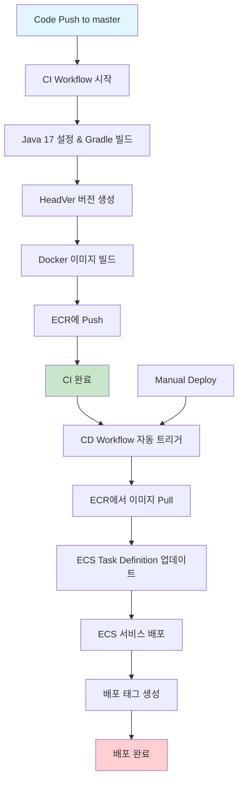

# ECS Fargate HA Infra

## 들어가며

컨테이너 오케스트레이션을 위해 AWS ECS를 도입하면서 겪었던 시행착오와 실무 경험을 정리했다. ECS의 기본 개념부터 Fargate와 EC2 선택 기준, CI/CD 구축까지 실제 운영에서 필요한 내용들을 담았다.

## 1. ECS 기본 이해하기

### ECS란 무엇인가

ECS(Elastic Container Service)는 AWS에서 제공하는 완전 관리형 컨테이너 오케스트레이션 서비스다. 쿠버네티스와 비교했을 때 훨씬 단순하고 AWS 생태계와의 연동이 뛰어나다는 장점이 있다.

**ECS vs EKS 선택 기준**

- **ECS**: 단순함을 추구하고 AWS 서비스와의 연동이 중요한 경우
- **EKS**: 쿠버네티스 생태계와 멀티 클라우드를 고려하는 경우

개인적으로는 AWS 환경에서만 운영한다면 ECS를 강력히 추천한다. 컨트롤 플레인 비용도 없고 학습 곡선이 완만하다.

### 핵심 구성 요소

**클러스터(Cluster)**
- 태스크와 서비스를 논리적으로 묶는 단위
- EC2 또는 Fargate를 컴퓨팅 엔진으로 선택 가능

**태스크(Task)**
- 실행의 최소 단위
- 하나 이상의 컨테이너로 구성

**태스크 정의(Task Definition)**
- 태스크 실행에 필요한 모든 정보를 담은 JSON 템플릿
- 이미지, CPU, 메모리, 권한 등을 명시

**서비스(Service)**
- 원하는 수의 태스크를 지속적으로 유지
- 로드밸런서와 연결하여 트래픽 분산

## 2. Fargate vs EC2 현실적인 선택

### Fargate의 장단점

**장점**
- 서버 관리 부담 제로
- 태스크 간 VM 레벨 격리로 보안 강화
- 자동 OS 패치 및 보안 업데이트
- ECS EXEC로 컨테이너 접속 가능

**단점**
- GPU 미지원
- 호스트 레벨 접근 불가
- EC2 대비 13-18% 높은 단위 비용

### 언제 Fargate를 선택할까?

대부분의 경우 **Fargate**를 추천한다. 이유는 단순하다:

1. **운영 부담 감소**: 인스턴스 관리, 패치, 모니터링 불필요
2. **실제 비용 효율성**: 단위 비용은 높지만 리소스 효율성을 고려하면 오히려 저렴
3. **확장성**: 트래픽 변동이 큰 서비스에 유리

### EC2가 유리한 경우

- GPU 필요한 워크로드
- 워크로드가 매우 예측 가능한 경우
- 리소스 사용률을 90% 이상 유지할 수 있는 경우

### EC2 비용 최적화 실전 팁

EC2를 선택했다면 **Bin Packing 전략**을 활용하자:

```json
{
  "placementStrategy": [
    {
      "type": "binpack",
      "field": "cpu"
    }
  ]
}
```

이 설정으로 리소스 사용률을 40%에서 90%까지 끌어올린 경험이 있다. Lambda와 Serverless 프레임워크로 구현하면 월 1-2달러로 운영 가능하다.

## 3. EKS, ECS 시각화 인프라 비교 

### EKS


### Kubernetes 아키텍처
구조

Cluster Master Node: 클러스터를 관리하는 마스터 노드가 존재
여러 개의 Worker Node (Server VM): EC2 인스턴스들로 구성
Pod: 컨테이너를 감싸는 최소 배포 단위
Deployment: 여러 Pod를 관리하는 단위 (Deployment A, B, C)

특징

마스터 노드 존재: 클러스터를 관리하는 별도 마스터 노드가 필요 (추가 비용 발생)
Node 단위 스케일링: EC2 인스턴스 단위로 확장
비효율적 리소스 사용: 노드가 추가될 때 전체 EC2가 생성되므로 일부 공간이 낭비될 수 있음 (계단식 스케일링)
Pod 내 컨테이너: 하나의 Pod에 여러 컨테이너를 넣을 수 있지만, 1:1 권장

### ECS


### ECS with Fargate 아키텍처
구조

Task Definition: Pod에 해당하는 컨테이너 정의 (도커 이미지, 포트 등)
Service: Deployment에 해당하는 개념 (Service A, B, C)
Task: Pod에 해당하는 실행 단위
AWS Fargate: 서버리스 컴퓨팅 환경

특징

마스터 노드 없음: 관리형 서비스로 마스터 노드 불필요
서버리스: EC2를 직접 관리할 필요 없음
효율적 리소스 사용: 실제 사용하는 CPU/메모리만큼만 비용 지불
인크리멘탈 스케일링: Task 단위로 자동 확장되어 낭비 최소화


## 4. Service Discovery와 Service Connect

### Service Discovery

서비스 디스커버리란 컨테이너 환경에서 동적으로 변하는 IP주소 문제를 해결하는 매커니즘이다. 예를 들어서 Docker에서 컨테이너를 재시작을 하면 IP가 변경된다. 
이 문제를 해결하기 위해서 사용되며 AWS CloudMap과 통합하여 ECS의 서비스 단위로 네임스페이스를 지정한다. 이를 통하여 IP기반의 연결이 아닌 DNS기반의 연결로 문제를 해결한다.

```text
   my-redis.local → 10.0.1.28 (현재 IP)
   my-app.local → 10.0.1.15 (현재 IP)
   
   # Service Discovery 사용 전
   redis_host = "10.0.1.28"  # ❌ IP 주소가 바뀌면 문제 발생

    # Service Discovery 사용 후
    redis_host = "my-redis.local"  # ✅ 항상 동작
```

### Service Connect

Service Discovery의 진화된 버전으로, AWS에서 2022년에 출시한 더 간편하고 강력한 서비스 간 통신 솔루션이다.

**Service Connect의 핵심 차이점**

| 기능 | Service Discovery | Service Connect |
|------|------------------|-----------------|
| **서비스 디스커버리** | ✅ DNS 기반 | ✅ DNS 기반 + 프록시 |
| **로드 밸런싱** | ❌ 클라이언트 구현 필요 | ✅ 자동 제공 |
| **헬스 체크** | ❌ 수동 구현 | ✅ 자동 제공 |
| **재시도 로직** | ❌ 수동 구현 | ✅ 자동 제공 |
| **트래픽 모니터링** | ❌ 별도 구현 | ✅ CloudWatch 자동 연동 |

Service Connect를 사용하면 Envoy 프록시가 사이드카로 자동 주입되어, 서비스 간 통신에서 자동 재시도, 회로 차단, 관찰성 등을 제공한다.

## 5. ECR Private Repository 구성 (Mac Version)

### ECR이란

ECR(Elastic Container Registry)은 AWS에서 제공하는 완전 관리형 Docker 컨테이너 레지스트리다. 

**ECR 사용 이유**
- IAM 기반 보안 제어
- VPC 엔드포인트를 통한 프라이빗 네트워크 접근
- 이미지 취약점 스캔 기능
- ECS와의 완벽한 통합

### 5-1. IAM 사용자 생성

- 정책을 생성하고 다음의 권한을 추가한다. 
  - Elastic Container Registry
  - AmazonEC2ContainerRegistryFullAccess
- 이후 IAM의 Key를 생성한다. (사용 사례는 CLI를 선택한다.)

```shell
# AWS CLI 설정
aws configure
```

**AWS 계정 설정 과정:**
1. AWS Access Key ID 입력
2. AWS Secret Access Key 입력  
3. Default region name: `ap-northeast-2` (서울 리전)
4. Default output format: `json`

### 5-2. ECR Repository 생성

**AWS Console에서:**
1. ECR 서비스로 이동
2. `Create repository` 클릭
3. Repository name: `ecs-be-prod` 입력
4. Private 레포지토리 선택
5. `Create repository` 완료

### 5-3. Docker 이미지 빌드 및 푸시

ECR Repository 생성 후 "푸시 명령 보기"를 클릭하여 다음 명령어들을 순서대로 실행:

```shell
# 1. ECR 로그인
aws ecr get-login-password --region ap-northeast-2 | docker login --username AWS --password-stdin 949653644001.dkr.ecr.ap-northeast-2.amazonaws.com

# 2. Docker 이미지 빌드
docker build -t ecs-be-prod .

# 3. 이미지 태그 설정
docker tag ecs-be-prod:latest [계정ID].dkr.ecr.ap-northeast-2.amazonaws.com/ecs-be-prod:latest

# 4. ECR에 이미지 푸시
docker push [계정ID].dkr.ecr.ap-northeast-2.amazonaws.com/ecs-be-prod:latest
```

**주의사항:**
- 계정 ID (`123214123213`) 부분은 본인의 AWS 계정 ID로 변경
- Repository name은 실제 생성한 이름과 일치시켜야 함
- Dockerfile이 현재 디렉토리에 있어야 빌드 가능

## 6. GitHub Actions로 CI/CD 자동화

### 6-1. CI/CD 파이프라인 개요

ECS 배포를 위한 완전 자동화된 CI/CD 파이프라인을 구축했다. 이 파이프라인은 **CI(Continuous Integration)**와 **CD(Continuous Deployment)** 두 단계로 분리되어 있다.



### 6-2. CI 워크플로우 (빌드 & 푸시)

**트리거 조건:**
- `master` 브랜치에 푸시
- 수동 실행 (workflow_dispatch)

**주요 단계:**

1. **OIDC 인증**: AWS IAM Role 기반 안전한 인증
2. **Gradle 빌드**: Java 17 환경에서 Spring Boot 애플리케이션 빌드
3. **HeadVer 버전 관리**: `{HEAD}.{년주차}.{빌드번호}` 형식 (예: `0.2541.135`)
4. **Docker 이미지**: 멀티 태그 전략 (`latest` + 버전 태그)
5. **ECR 푸시**: AWS ECR Private Repository에 이미지 업로드

**버전 관리 전략:**
```text
HeadVer: 0.2541.135
├── 0: Head 버전 (주요 릴리즈)
├── 2541: 년주차 (25년 41주차)  
└── 135: 빌드 번호 (GitHub Actions run_number)
```

### 6-3. CD 워크플로우 (배포)

**트리거 조건:**
- CI 워크플로우 성공 완료 시 자동 실행
- 수동 실행 (특정 버전 지정 가능)

**배포 프로세스:**

```text
1. ECR 로그인 및 이미지 확인
   ↓
2. ECS Task Definition 업데이트
   - 새 이미지 URI로 컨테이너 정의 수정
   ↓
3. ECS 서비스 무중단 배포
   - Rolling Update 방식
   - Service Stability 대기
   ↓
4. 배포 태그 생성
   - 형식: ecs-deploy-{version}
   - 롤백 시점 추적용
```

### 6-4. 보안 및 권한 관리

**OIDC 기반 인증:**
- AWS Access Key 없이 안전한 인증
- 임시 자격 증명 사용 (세션 기반)
- 최소 권한 원칙 적용

**필요 권한:**
```json
{
  "ECR": [
    "GetAuthorizationToken",
    "BatchCheckLayerAvailability", 
    "GetDownloadUrlForLayer",
    "BatchGetImage",
    "PutImage"
  ],
  "ECS": [
    "UpdateService",
    "DescribeServices",
    "RegisterTaskDefinition"
  ]
}
```

### 6-5. 운영 편의성 기능

**1. 수동 배포 지원**
- 특정 버전으로 롤백 가능
- 핫픽스 배포 시 유용

**2. 배포 추적**
- Git 태그로 배포 이력 관리
- 각 배포마다 고유 태그 생성

**3. 실패 시 안전장치**
- Service Stability 체크
- 배포 실패 시 자동 롤백

### 6-6. 실제 운영 경험

**장점:**
- **완전 자동화**: 코드 푸시만으로 프로덕션 배포
- **추적 가능성**: 모든 배포가 Git 태그로 추적됨  
- **안전성**: OIDC + 최소 권한으로 보안 강화
- **롤백 용이성**: 언제든 이전 버전으로 배포 가능

**주의사항:**
- Task Definition 파일은 Git으로 관리 필수
- ECS 서비스명, 클러스터명 등 환경별 설정 필요
- 첫 배포 시 ECS 서비스가 미리 생성되어 있어야 함

**관련 문서:**
- [OIDC 설정 가이드](https://docs.github.com/ko/actions/how-tos/secure-your-work/security-harden-deployments/oidc-in-aws)
- [전체 코드 레포지토리](https://github.com/KMGeon/ecs_be_prod)


