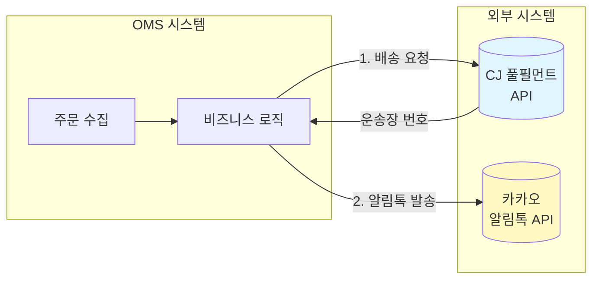
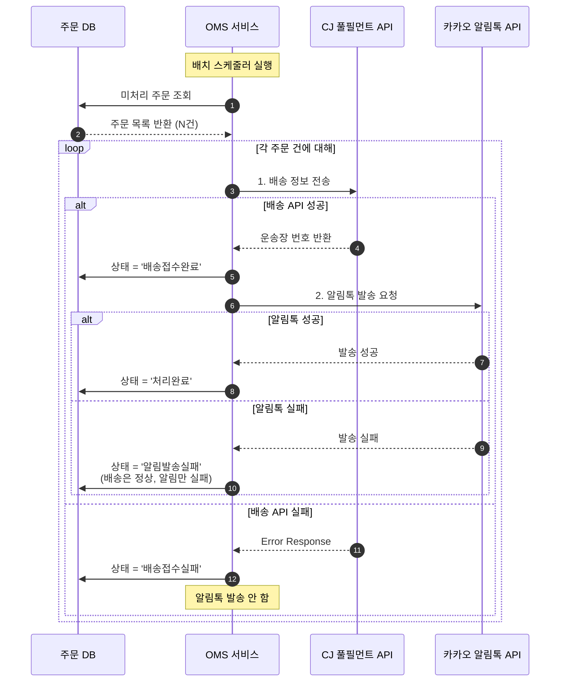
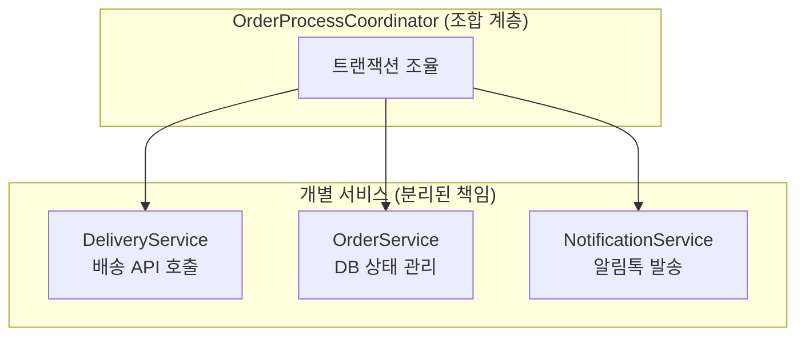
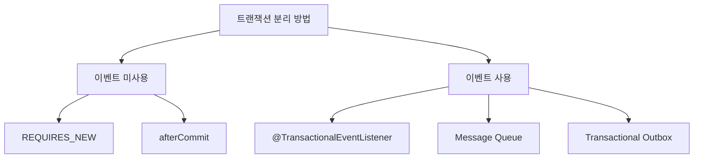
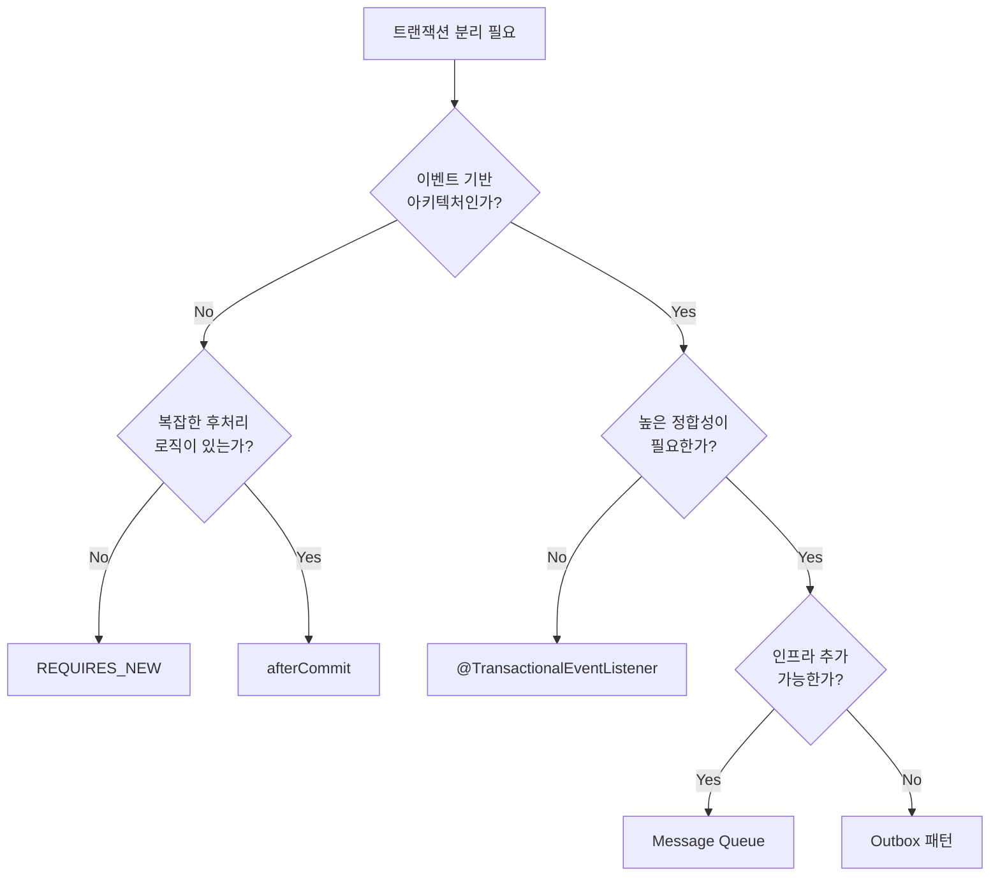

# 서론

---

회사에서 업무를 하다보면 외부 API를 사용이 많습니다. 그런데 외부 API 단순히 호출로만 한다면 그것은 잘못된 방식이라고 생각합니다.
외부 API를 사용함에 있어서 우리는 많은 고민을 가지고 있어야 합니다.

제가 담당한 업무에서 실제로 사용한 과정과 고민을 작성을 하려고 합니다. 그러기 위해서는 독자를 위해서 시나리오가 있어야 될 거 같습니다.

서론에서는 제가 담당한 업무의 비슷하게 시나리오를 만들어서 이것을 해결하는 방식에 대해서 설명을 하겠습니다.

---

## 시나리오

### 전체 시스템 구조

우리는 **이커머스 OMS(Order Management System)** 프로그램을 구축합니다.
수집된 주문에 대해 비즈니스 로직을 수행하고, 배송사(CJ 풀필먼트)에 배송 정보를 전달한 뒤 고객에게 알림톡을 발송하는 시스템입니다.



### 상세 비즈니스 흐름

주문 처리의 전체 흐름입니다. **핵심 문제는 배송 API 성공 후 알림톡이 실패하면 어떻게 처리할 것인가?** 입니다.



---

## API 제약 조건

외부 API 연동 시 반드시 고려해야 하는 제약 조건들이 있습니다.

### 1. Rate Limit (요청 제한)

CJ API는 IP당 요청 제한이 있습니다. **초당 10건**, **분당 100건**을 초과하면 `429 Too Many Requests` 응답이 반환됩니다. 연속으로 5회 이상 제한을 초과하면 해당 IP가 5분간
차단됩니다.

이 제한을 무시하고 요청을 보내면 전체 배치 작업이 실패할 수 있습니다.

### 2. 부분 실패 허용 요구사항

**핵심 요구사항**: 전체 20건 중 1건이 실패하더라도 나머지 19건은 정상적으로 처리되어야 합니다.

예를 들어 10번째 주문에서 네트워크 오류가 발생했다고 해서 11~20번 주문 처리가 중단되면 안 됩니다. 실패한 건은 별도로 기록하고, 나머지는 계속 진행해야 합니다.

---

## 우리가 마주할 문제들

단순히 API를 호출하는 것만으로는 안정적인 시스템을 만들 수 없습니다. 다음과 같은 문제들을 반드시 고려해야 합니다.

**네트워크 문제**

- 타임아웃: 외부 API 응답이 10초 이상 지연되면 우리 시스템까지 멈춥니다.
- 연결 실패: 일시적인 네트워크 장애로 연결 자체가 안 될 수 있습니다.

**API 제약**

- Rate Limit: 요청을 너무 빨리 보내면 전체 요청이 실패합니다.
- 인증 만료: API Key가 만료되거나 변경될 수 있습니다.

**데이터 정합성**

- 중복 전송: 재시도 시 같은 주문이 2번 배송될 위험이 있습니다.
- 부분 실패: 20건 중 1건만 실패해도 데이터 불일치가 발생합니다.

**장애 대응**

- 외부 API가 다운되면 주문 처리 전체가 중단됩니다.
- 적절한 재시도 전략과 Circuit Breaker가 필요합니다.

---

## 비즈니스 코드 예시 (Before)

가장 단순한 형태의 구현입니다. 이 코드가 가진 문제점을 본론에서 하나씩 해결합니다.

```java
@Service
@RequiredArgsConstructor
public class DeliveryService {

    @Transactional
    public void sendDeliveryInfo(List<Order> orders) {
        for (Order order : orders) {
            // 1. 배송 API 호출
            DeliveryResponse response = cjClient.sendDelivery(DeliveryRequest.from(order));

            if (!response.isSuccess()) {
                throw new DeliveryFailedException("배송 접수 실패: " + response.getMessage());
            }

            // 2. DB 상태 업데이트
            order.markAsSent(response.getTrackingNumber());
            orderRepository.save(order);

            // 3. 알림톡 발송 - 여기서 예외 발생하면?
            kakaoClient.send(AlimtalkRequest.from(order, response.getTrackingNumber()));
        }
    }
}
```

# 본론

---

## 문제 정의하기

위 코드는 배송 API 호출 → DB 저장 → 알림톡 발송 순서로 동작합니다. 하지만 다음과 같은 문제가 있습니다.

| 문제 | 설명 |
|------|------|
| **트랜잭션 범위** | `@Transactional`은 DB만 롤백하고, 외부 API는 롤백되지 않아 데이터 불일치 발생 |
| **부분 실패 미처리** | 한 건 실패 시 나머지 주문도 처리되지 않음 |
| **Rate Limit 미고려** | 대량 요청 시 `429 Too Many Requests` 오류 발생 가능 |
| **재시도 로직 없음** | 일시적 네트워크 오류에도 즉시 실패 처리 |
| **타임아웃 미설정** | 외부 API 응답 지연 시 스레드가 무한 대기 |

---

## 핵심 해결 전략

본론에서는 두 가지 핵심 전략으로 문제를 해결합니다.

1. **계층 분리와 트랜잭션 분리**: Facade/Coordinator 패턴으로 각 책임을 분리하고, 트랜잭션 경계를 명확히 함
2. **안정성 확보**: Rate Limit, Retry, Timeout 등을 통한 외부 API 호출 안정화

---

## Part 1: 계층 분리와 트랜잭션 분리

### 설계 원칙: Facade/Coordinator 패턴

외부 API 연동에서 가장 중요한 것은 **각 계층을 분리**하고, **Facade 또는 Coordinator에서 조합**하여 사용하는 것입니다.



```java
@Component
@RequiredArgsConstructor
public class OrderProcessCoordinator {

    private final DeliveryService deliveryService;
    private final OrderService orderService;
    private final NotificationService notificationService;

    public void processOrder(Order order) {
        // 1. 배송 API 호출 (트랜잭션 X)
        DeliveryResult result = deliveryService.sendDelivery(order);

        // 2. DB 상태 업데이트 (독립 트랜잭션)
        orderService.updateDeliveryStatus(order.getId(), result);

        // 3. 알림톡 발송 (독립 트랜잭션)
        notificationService.sendAlimtalk(order.getId(), result.getTrackingNumber());
    }
}
```

이렇게 분리하면 각 단계가 **독립적인 트랜잭션**으로 처리되어, 알림톡 실패가 배송 정보 저장에 영향을 주지 않습니다.

> **확장**: 여러 외부 시스템 간의 정합성이 필요하다면 **Saga Coordinator 패턴**으로 확장할 수 있습니다. 각 단계의 성공/실패에 따라 보상 트랜잭션을 실행하는 방식입니다.

---

### 트랜잭션 분리 방법

트랜잭션을 분리하는 방법은 크게 **이벤트 사용 여부**로 나눌 수 있습니다.



---

### 방식 1: 이벤트를 사용하지 않는 방법

이벤트 발행 없이 직접 트랜잭션을 분리하는 방식입니다. 구현이 단순하고 흐름을 직관적으로 파악할 수 있습니다.

#### REQUIRES_NEW (대표 예시)

```java
@Component
public class OrderService {

    @Transactional(propagation = Propagation.REQUIRES_NEW)
    public void updateDeliveryStatus(Long orderId, DeliveryResult result) {
        Order order = orderRepository.findById(orderId).orElseThrow();

        if (result.isSuccess()) {
            order.markAsSent(result.getTrackingNumber());
        } else {
            order.markAsDeliveryFailed(result.getMessage());
        }
        orderRepository.save(order);
    }
}

@Component
public class NotificationService {

    @Transactional(propagation = Propagation.REQUIRES_NEW)
    public void sendAlimtalk(Long orderId, String trackingNumber) {
        Order order = orderRepository.findById(orderId).orElseThrow();

        try {
            kakaoClient.send(AlimtalkRequest.from(order, trackingNumber));
            order.markAsCompleted();
        } catch (Exception e) {
            order.markAsAlimtalkFailed();
        }
        orderRepository.save(order);
    }
}
```

`REQUIRES_NEW`는 호출될 때마다 새로운 트랜잭션을 생성합니다. 각 서비스가 독립적으로 커밋되므로 한 단계의 실패가 다른 단계에 영향을 주지 않습니다.

#### afterCommit

`TransactionSynchronization.afterCommit()`을 사용하면 현재 트랜잭션이 커밋된 후에 특정 로직을 실행할 수 있습니다. 단, **기존 엔티티가 detached 상태**이므로 새 트랜잭션에서 다시 조회해야 합니다.

**이벤트 미사용 방식 비교**

| 방법 | 특징 | 주의사항 |
|------|------|----------|
| **REQUIRES_NEW** | 즉시 새 트랜잭션 생성 | 부모 트랜잭션 롤백 시 자식은 이미 커밋됨 |
| **afterCommit** | 커밋 확정 후 실행 | detached entity 주의, 코드 복잡 |

---

### 방식 2: 이벤트를 사용하는 방법

이벤트를 발행하고, 리스너에서 후속 작업을 처리하는 방식입니다. 계층 간 결합도를 낮추고, 비동기 처리가 자연스럽습니다.

#### @TransactionalEventListener (대표 예시)

```java
// 이벤트 정의
public record DeliveryCompletedEvent(Long orderId, String trackingNumber) {}

@Service
public class DeliveryService {

    @Transactional
    public void processDelivery(Order order) {
        DeliveryResponse response = cjClient.sendDelivery(DeliveryRequest.from(order));

        if (response.isSuccess()) {
            order.markAsSent(response.getTrackingNumber());
            orderRepository.save(order);

            // 이벤트 발행 - 트랜잭션 커밋 후 처리됨
            eventPublisher.publishEvent(
                new DeliveryCompletedEvent(order.getId(), response.getTrackingNumber())
            );
        }
    }
}

@Component
public class AlimtalkEventHandler {

    @Async
    @TransactionalEventListener(phase = TransactionPhase.AFTER_COMMIT)
    @Transactional
    public void onDeliveryCompleted(DeliveryCompletedEvent event) {
        Order order = orderRepository.findById(event.orderId()).orElseThrow();

        try {
            kakaoClient.send(AlimtalkRequest.from(order, event.trackingNumber()));
            order.markAsCompleted();
        } catch (Exception e) {
            order.markAsAlimtalkFailed();
        }
        orderRepository.save(order);
    }
}
```

`@TransactionalEventListener(phase = AFTER_COMMIT)`은 트랜잭션이 성공적으로 커밋된 후에만 실행됩니다. `@Async`와 함께 사용하면 별도 스레드에서 독립적인 트랜잭션으로 처리됩니다.

#### Message Queue / Outbox 패턴

더 높은 안정성이 필요한 경우 Message Queue나 Outbox 패턴을 사용합니다.

- **Message Queue**: `@TransactionalEventListener`에서 메시지 발송. Consumer가 독립적으로 처리
- **Outbox 패턴**: 이벤트를 DB에 먼저 저장(같은 트랜잭션)하고, 별도 스케줄러가 폴링하여 처리. 트랜잭션 롤백 시에도 메시지 유실 없음

> **주의**: Message Queue 사용 시, `@Transactional` 내부에서 직접 메시지를 발송하면 트랜잭션 롤백 시에도 메시지는 이미 전송된 상태가 됩니다. 반드시 `AFTER_COMMIT` 단계에서 발송해야 합니다.

**이벤트 사용 방식 비교**

| 방법 | 특징 | 적합한 상황 |
|------|------|------------|
| **@TransactionalEventListener** | 간단한 이벤트 기반 처리 | 일반적인 비동기 후처리 |
| **Message Queue** | 재시도, 확장성 우수 | 대규모 시스템, 분산 환경 |
| **Outbox 패턴** | 데이터 정합성 완벽 보장 | 정합성이 가장 중요한 경우 |

---

### 어떤 방식을 선택해야 할까?



**간단한 선택 기준**:
- 흐름이 단순하고 직관성이 중요하다 → **REQUIRES_NEW**
- 커밋 후 비동기 처리가 필요하다 → **@TransactionalEventListener + @Async**
- 메시지 유실이 절대 없어야 한다 → **Outbox 패턴**

---

## Part 2: 안정성 확보

외부 API 호출 시 Rate Limit, Retry, Timeout을 적용하여 안정성을 확보합니다.

### Rate Limit 처리

```java
@Bean
public RateLimiter cjApiRateLimiter() {
    RateLimiterConfig config = RateLimiterConfig.custom()
        .limitRefreshPeriod(Duration.ofSeconds(1))  // 1초마다 리셋
        .limitForPeriod(10)                          // 초당 10건 제한
        .timeoutDuration(Duration.ofSeconds(5))      // 대기 최대 5초
        .build();
    return RateLimiter.of("cjApi", config);
}
```

### Retry 처리

```java
@Retryable(
    retryFor = {RestClientException.class, SocketTimeoutException.class},
    maxAttempts = 3,
    backoff = @Backoff(delay = 1000, multiplier = 2)  // 1초, 2초, 4초
)
public DeliveryResponse sendDelivery(DeliveryRequest request) {
    // ... 실제 API 호출
}

@Recover
public DeliveryResponse recoverSendDelivery(Exception e, DeliveryRequest request) {
    log.error("배송 API 호출 최종 실패: orderId={}", request.getOrderId(), e);
    return DeliveryResponse.failure("재시도 초과");
}
```

### Timeout 설정

```java
@Bean
public RestTemplate restTemplate() {
    HttpComponentsClientHttpRequestFactory factory = new HttpComponentsClientHttpRequestFactory();
    factory.setConnectTimeout(3000);   // 연결 타임아웃 3초
    factory.setReadTimeout(5000);      // 읽기 타임아웃 5초
    return new RestTemplate(factory);
}
```

### 통합 적용

실제 운영 환경에서는 Rate Limit + Retry + Timeout을 함께 적용합니다.

```java
public DeliveryResponse sendDelivery(DeliveryRequest request) {
    Supplier<DeliveryResponse> decoratedSupplier = Decorators
        .ofSupplier(() -> doSendDelivery(request))
        .withRateLimiter(rateLimiter)
        .withRetry(retry)
        .decorate();

    try {
        return decoratedSupplier.get();
    } catch (Exception e) {
        log.error("배송 API 호출 실패: orderId={}", request.getOrderId(), e);
        return DeliveryResponse.failure(e.getMessage());
    }
}
```

---

# 정리

외부 API 연동 시 핵심은 **계층 분리**와 **트랜잭션 분리**입니다.

**1. 계층 분리**
- 각 책임을 분리하여 Facade/Coordinator에서 조합
- 필요시 Saga Coordinator 패턴으로 분산 트랜잭션 처리

**2. 트랜잭션 분리**

| 구분 | 방법 | 특징 |
|------|------|------|
| **이벤트 미사용** | REQUIRES_NEW, afterCommit | 직관적, 단순한 흐름 |
| **이벤트 사용** | @TransactionalEventListener, MQ, Outbox | 결합도 낮음, 확장성 우수 |

**3. 안정성 확보**
- **Rate Limiter**: 요청 속도 제어
- **Retry**: 일시적 오류 재시도
- **Timeout**: 응답 지연 방지

상황에 맞는 방법을 선택하되, 데이터 정합성과 시스템 복잡도 사이의 균형을 고려해야 합니다.

---

# 참고

- [Transactional Outbox Pattern](https://microservices.io/patterns/data/transactional-outbox.html)
- [Spring Retry](https://github.com/spring-projects/spring-retry)
- [Resilience4j](https://resilience4j.readme.io/)
- [Spring Transaction Propagation](https://docs.spring.io/spring-framework/reference/data-access/transaction/declarative/tx-propagation.html)
- [Saga Pattern](https://microservices.io/patterns/data/saga.html)
