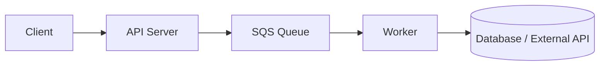
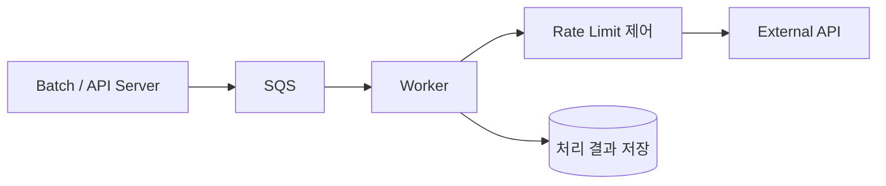
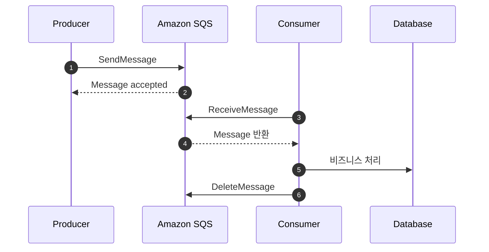
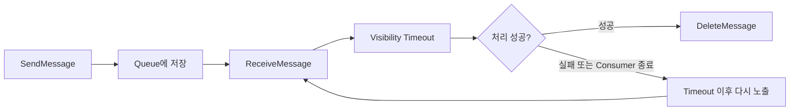
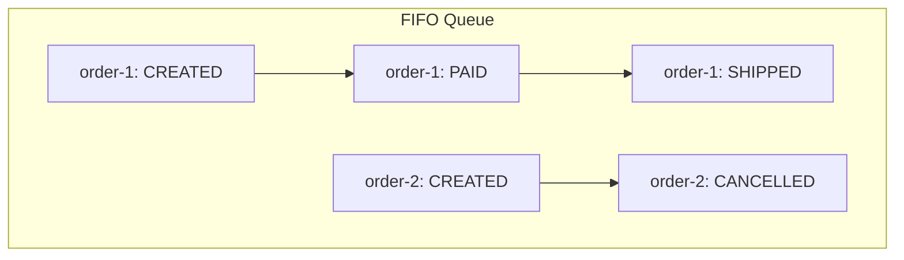
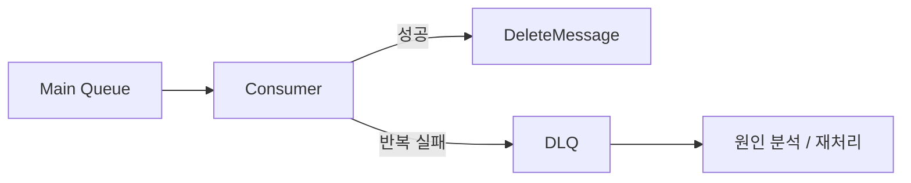
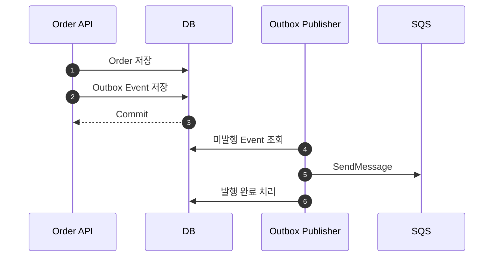
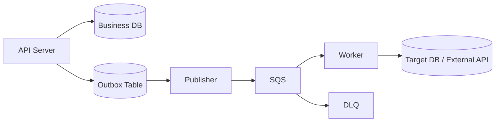

# 서론

메시지 큐로 AWS SQS를 학습하고, 실제로 도입을 고민했던 과정까지 정리해보려고 합니다.

처음에는 단순히 "비동기 처리를 위해 큐를 둔다" 정도로만 이해하고 있었습니다.
하지만 자료를 찾아보고 실제 시스템에 적용한다고 생각해보니, 메시지 큐는 단순한 비동기 도구가 아니라 **트래픽을 흡수하고, 장애 전파를 줄이고, 처리 속도를 조절하는 운영 장치**에 가까웠습니다.

이 글에서는 메시지 큐의 개념부터 AWS SQS의 주요 특징, 그리고 도입할 때 고민해야 하는 부분을 정리해보겠습니다.

---

# 본론

## 메시지 큐란 무엇인가

비동기 메시지 큐를 이해하려면 먼저 `비동기`와 `메시지 큐`를 나눠서 생각하는 것이 좋습니다.

`비동기`는 현재 스레드나 현재 프로세스의 호출 흐름에서 결과를 즉시 받지 않아도 다음 작업을 계속 진행하는 방식입니다.
예를 들어 사용자가 요청을 보냈을 때, 서버가 모든 작업을 끝낼 때까지 기다리지 않고 "요청을 받았다"는 응답을 먼저 줄 수 있습니다.

`메시지 큐`는 이 비동기 작업을 시간적으로 안전하게 보관하고, 생산자와 소비자의 실패 도메인을 분리하기 위한 시스템 장치입니다.
즉, 요청을 받는 쪽과 실제로 처리하는 쪽 사이에 큐를 두고, 둘의 속도를 분리합니다.



동기 방식에서는 API 서버가 외부 API 호출, DB 저장, 후속 처리까지 모두 끝내고 응답해야 합니다.
반대로 큐를 사용하면 API 서버는 메시지를 큐에 넣고 빠르게 응답할 수 있고, Worker가 큐에서 메시지를 꺼내 나중에 처리합니다.

스프링의 `@Async`와 비교하면 차이가 더 명확합니다.

`@Async`는 같은 JVM 안에서 실행 스레드를 바꾸는 도구입니다.
애플리케이션 프로세스가 죽으면 아직 처리되지 않은 작업도 같이 사라질 수 있고, 여러 서버 인스턴스 간에 작업을 안정적으로 나누기도 어렵습니다.

반면 MQ는 프로세스와 노드를 넘어섭니다.
메시지를 외부 시스템에 저장하고, 여러 Worker가 나눠 처리할 수 있으며, 실패한 작업을 다시 시도하거나 별도 큐로 격리할 수 있습니다.

| 구분 | @Async | Message Queue |
| --- | --- | --- |
| 실행 범위 | 같은 JVM 내부 | 프로세스/서버 외부 |
| 작업 보관 | 애플리케이션 메모리 의존 | 큐에 저장 |
| 서버 장애 시 | 작업 유실 가능 | 재처리 가능 |
| 처리 속도 조절 | 제한적 | Consumer 수, polling 속도 등으로 조절 |
| 운영 관점 | 코드 레벨 비동기 | 인프라 레벨 비동기 |

그래서 메시지 큐는 단순히 "비동기로 처리하자"가 아니라, **요청과 처리를 분리해서 시스템을 더 안정적으로 운영하자**에 가깝습니다.

## 왜 SQS를 고민하게 되었나

메시지 큐가 필요한 상황은 보통 트래픽이 갑자기 몰리거나, 특정 작업이 오래 걸리거나, 외부 시스템의 처리 속도에 우리 시스템이 같이 흔들릴 때입니다.

우리는 SQS를 주로 다음과 같은 작업에 사용할 수 있다고 봤습니다.

- 대량 알림 발송
- 로그 적재 같은 후처리
- 주문 처리 이후의 부가 작업
- 외부 API 연동

이런 작업을 요청 흐름 안에서 모두 처리하면 API 응답 시간이 길어지고, 외부 시스템이 느려질 때 우리 서버도 같이 느려집니다.
또한 특정 시간에 요청이 몰리면 서버나 DB가 순간 부하를 그대로 받게 됩니다.

그중에서 가장 크게 문제가 됐던 부분은 외부 API 연동이었습니다.
외부 API는 우리 시스템처럼 마음대로 처리량을 늘릴 수 없습니다.
보통 초당 요청 수, 분당 요청 수 같은 제한이 있고, 이 제한을 넘기면 `429 Too Many Requests` 같은 응답을 받거나 일정 시간 요청이 차단될 수 있습니다.

예를 들어 외부 API 제약이 다음과 같다고 가정해보겠습니다.

| 제약 | 의미 |
| --- | --- |
| 초당 10건 | 1초에 10건 이상 보내면 제한에 걸릴 수 있음 |
| 분당 300건 | 짧은 순간에는 통과해도 1분 누적량이 넘으면 실패 |
| 실패 시 재시도 필요 | 일시적인 실패와 영구 실패를 구분해야 함 |
| 처리 결과 저장 필요 | 요청만 보내고 끝나는 것이 아니라 결과를 DB에 반영해야 함 |

처음에는 배치 작업에서 대상 데이터를 읽고 외부 API를 순차적으로 호출하는 방식도 생각할 수 있습니다.
하지만 이 방식은 데이터가 많아질수록 부담이 커집니다.

배치가 한 번에 많은 데이터를 조회하고, 각 건마다 외부 API 응답을 기다리고, 그 결과를 DB에 반영하면 작업 시간이 길어집니다.
이때 트랜잭션 범위를 잘못 잡으면 외부 API를 기다리는 동안 DB 트랜잭션을 오래 물고 있게 됩니다.

```java
@Transactional
public void sendBatch(List<NotificationTarget> targets) {
    for (NotificationTarget target : targets) {
        ExternalApiResponse response = externalApiClient.send(target);
        target.markSent(response.getResultCode());
    }
}
```

위와 같은 코드는 단순해 보이지만, 실제 운영에서는 위험합니다.

- 외부 API가 느려지면 트랜잭션 시간이 같이 길어진다.
- 처리 대상이 많으면 DB 커넥션을 오래 점유한다.
- 중간에 실패하면 어디까지 처리됐는지 애매해진다.
- API rate limit을 넘기지 않도록 배치 속도를 계속 조절해야 한다.
- 한 건의 실패가 전체 배치 흐름에 영향을 줄 수 있다.

그래서 외부 API 호출을 배치 트랜잭션 안에서 직접 오래 끌고 가기보다, 처리해야 할 작업을 메시지로 쪼개고 Worker가 제한된 속도로 처리하는 구조가 더 적합하다고 판단했습니다.



이렇게 하면 배치의 역할은 "처리 대상 생성"에 가까워지고, 실제 외부 API 호출은 Worker가 담당합니다.
Worker 수와 polling 속도를 조절하면 외부 API의 초당/분당 제한에 맞춰 처리량을 제한할 수 있습니다.
또한 실패한 메시지는 재시도하거나 DLQ로 보내서 따로 확인할 수 있습니다.

채널톡의 SQS 도입 사례에서도 비슷한 문제가 나옵니다.
예측 가능한 일반 트래픽은 오토스케일링으로 대응할 수 있지만, 순간적으로 몰리는 Spike 트래픽은 인스턴스가 새로 뜨기 전에 이미 기존 서버가 요청을 받아버리는 문제가 있습니다.
이때 요청을 바로 처리하지 않고 SQS에 쌓아두면, Worker가 일정한 속도로 꺼내 처리하면서 뒷단 저장소나 외부 시스템의 부하를 완화할 수 있습니다.

저도 SQS를 보면서 가장 크게 느낀 부분은 이것이었습니다.

> 큐는 일을 빠르게 끝내기 위한 도구라기보다, 일을 망가지지 않게 나눠 처리하기 위한 도구다.

SQS를 넣는다고 전체 처리 시간이 항상 짧아지는 것은 아닙니다.
오히려 사용자는 결과를 조금 늦게 받을 수도 있습니다.
대신 API 서버, DB, 외부 API가 한 번에 터지는 상황을 줄일 수 있습니다.
특히 외부 API처럼 우리 쪽에서 처리량을 마음대로 늘릴 수 없는 시스템과 연동할 때는, 큐가 완충 지대 역할을 해줍니다.

## AWS SQS란 무엇인가

AWS SQS(Simple Queue Service)는 AWS에서 제공하는 완전 관리형 메시지 큐 서비스입니다.
직접 RabbitMQ나 Kafka 같은 브로커를 설치하고 운영하지 않아도, AWS API를 통해 메시지를 보내고 받을 수 있습니다.

SQS의 기본 구성은 단순합니다.

| 구성 요소 | 설명 |
| --- | --- |
| Producer | 메시지를 큐에 넣는 애플리케이션 |
| Queue | 메시지를 저장하는 SQS 대기열 |
| Consumer | 큐에서 메시지를 읽고 처리하는 애플리케이션 |
| Message | 처리해야 할 작업 데이터 |

흐름은 다음과 같습니다.



중요한 점은 Consumer가 메시지를 읽었다고 해서 SQS에서 바로 삭제되지 않는다는 것입니다.
Consumer가 처리를 끝낸 뒤 `DeleteMessage`를 호출해야 메시지가 삭제됩니다.

만약 Worker가 메시지를 읽고 처리하는 도중 죽으면 어떻게 될까요?
메시지는 삭제되지 않았기 때문에 일정 시간이 지나 다시 큐에 나타나고, 다른 Worker가 다시 처리할 수 있습니다.

이 구조 때문에 SQS는 장애 상황에서도 작업을 재시도할 수 있습니다.
대신 같은 메시지가 다시 처리될 수 있으므로, Consumer 로직은 멱등성을 고려해야 합니다.

## SQS 메시지 생명주기

SQS 메시지의 흐름을 조금 더 자세히 보면 다음과 같습니다.



메시지를 받으면 해당 메시지는 바로 삭제되는 것이 아니라 **in-flight 상태**가 됩니다.
이때 다른 Consumer에게는 보이지 않습니다.
이 시간을 `Visibility Timeout`이라고 합니다.

Consumer가 처리에 성공하면 `DeleteMessage`를 호출해서 메시지를 삭제합니다.
반대로 처리 중 예외가 발생하거나 Consumer가 죽으면 메시지는 삭제되지 않고, Visibility Timeout이 지난 뒤 다시 처리 대상이 됩니다.

여기서 SQS를 사용할 때 중요한 운영 포인트가 나옵니다.

- Consumer 처리 시간보다 Visibility Timeout을 짧게 잡으면 같은 메시지가 중복 처리될 수 있다.
- Visibility Timeout을 너무 길게 잡으면 실패한 메시지가 다시 처리되기까지 오래 걸린다.
- 처리가 계속 실패하는 메시지는 원본 큐에 계속 남아 Consumer 리소스를 잡아먹는다.

그래서 Visibility Timeout은 평균 처리 시간과 최대 처리 시간을 기준으로 잡아야 합니다.
처리 시간이 들쭉날쭉하다면 `ChangeMessageVisibility`로 처리 중간에 timeout을 연장하는 방식도 고려할 수 있습니다.

## Standard Queue와 FIFO Queue

SQS에는 크게 두 가지 큐 타입이 있습니다.

- Standard Queue
- FIFO Queue

처음에는 FIFO가 더 안전해 보였습니다.
이름 그대로 순서가 보장되고 중복도 줄여주기 때문입니다.
하지만 실제로는 모든 상황에서 FIFO가 정답은 아닙니다.

| 구분 | Standard Queue | FIFO Queue |
| --- | --- | --- |
| 처리량 | 매우 높음 | Standard보다 제한적 |
| 순서 보장 | Best-effort | Message Group 기준 순서 보장 |
| 전달 방식 | At-least-once | Exactly-once 처리에 가까운 중복 제거 지원 |
| 중복 가능성 | 있음 | Deduplication으로 완화 |
| 적합한 상황 | 대량 처리, 순서가 중요하지 않은 작업 | 순서가 중요한 이벤트 처리 |

Standard Queue는 높은 처리량이 장점입니다.
대신 메시지가 두 번 이상 전달될 수 있고, 순서가 완전히 보장되지는 않습니다.
그래서 Consumer가 중복 처리와 순서 뒤바뀜을 감당할 수 있어야 합니다.

예를 들어 로그 저장, 통계 적재, 이미지 처리처럼 순서보다 처리량이 중요한 작업이라면 Standard Queue가 더 자연스럽습니다.

FIFO Queue는 순서가 중요할 때 사용합니다.
예를 들어 하나의 주문에 대해 `CREATED -> PAID -> CANCELLED` 같은 이벤트가 순서대로 처리되어야 한다면 FIFO가 필요할 수 있습니다.

다만 FIFO에서도 전체 큐가 하나의 줄로만 동작하는 것은 아닙니다.
`MessageGroupId`를 기준으로 순서가 보장됩니다.
같은 그룹 안에서는 순서가 지켜지고, 서로 다른 그룹은 병렬로 처리될 수 있습니다.



이 구조를 잘 쓰면 `주문 ID`, `회원 ID`, `상품 ID` 같은 기준으로 순서를 보장하면서도 병렬성을 확보할 수 있습니다.
반대로 MessageGroupId를 너무 넓게 잡으면 한 그룹에 메시지가 몰려 병목이 생길 수 있습니다.

## SQS를 도입할 때 가장 중요한 것: 멱등성

SQS를 공부하면서 가장 중요하다고 느낀 것은 멱등성입니다.

Standard Queue는 최소 1회 전달을 보장합니다.
말은 좋아 보이지만, 뒤집어 말하면 같은 메시지가 두 번 이상 처리될 수 있다는 뜻입니다.
FIFO Queue를 사용하더라도 네트워크 실패, Consumer 장애, ACK 실패 같은 상황까지 생각하면 Consumer 쪽에서는 중복 처리를 방어하는 것이 안전합니다.

예를 들어 메시지를 처리하는 도중 이런 일이 생길 수 있습니다.

1. Worker가 메시지를 받는다.
2. DB 저장은 성공한다.
3. SQS에 `DeleteMessage`를 호출하기 전에 Worker가 죽는다.
4. Visibility Timeout 이후 같은 메시지가 다시 나타난다.
5. 다른 Worker가 같은 메시지를 다시 처리한다.

이때 DB insert만 단순히 실행하면 중복 데이터가 생길 수 있습니다.
사용자에게 알림을 보내는 작업이라면 같은 알림이 두 번 발송될 수도 있습니다.

그래서 Consumer는 메시지가 여러 번 들어와도 결과가 한 번 처리된 것처럼 동작해야 합니다.

예를 들어 다음과 같은 방식이 있습니다.

- 메시지마다 고유한 `eventId`를 둔다.
- 처리 완료된 eventId를 별도 테이블에 저장한다.
- 같은 eventId가 다시 들어오면 이미 처리된 메시지로 보고 무시한다.
- DB write는 가능하면 upsert나 unique key 기반으로 설계한다.

```java
@Transactional
public void handle(OrderEvent event) {
    if (processedEventRepository.existsByEventId(event.eventId())) {
        return;
    }

    orderService.apply(event);
    processedEventRepository.save(new ProcessedEvent(event.eventId()));
}
```

코드만 보면 간단하지만, 실제로는 이 부분이 SQS 도입의 핵심이라고 생각합니다.
큐를 도입하면 메시지 전달은 SQS가 도와주지만, **비즈니스 결과를 한 번만 반영하는 책임은 애플리케이션에 남습니다.**

## 실패 메시지는 어떻게 처리할까: DLQ

모든 메시지가 정상적으로 처리되면 좋겠지만, 실제 운영에서는 계속 실패하는 메시지가 생깁니다.

예를 들어 다음과 같은 경우입니다.

- 메시지 payload 형식이 잘못된 경우
- 참조해야 하는 데이터가 이미 삭제된 경우
- 외부 API가 특정 요청만 계속 거부하는 경우
- Consumer 코드에 특정 케이스를 처리하지 못하는 버그가 있는 경우

이런 메시지를 원본 큐에 계속 남겨두면 Worker는 같은 메시지를 반복해서 가져오고 실패합니다.
결국 정상 메시지 처리까지 방해할 수 있습니다.

이때 사용하는 것이 DLQ(Dead Letter Queue)입니다.

DLQ는 지정한 횟수만큼 처리에 실패한 메시지를 별도 큐로 이동시키는 장치입니다.
예를 들어 `maxReceiveCount = 5`로 설정하면, 같은 메시지가 5번 처리 실패한 뒤 DLQ로 이동합니다.



DLQ를 두면 두 가지 장점이 있습니다.

첫째, 처리할 수 없는 메시지가 원본 큐를 계속 막지 않습니다.
둘째, 실패한 메시지를 따로 모아서 원인을 분석하고 재처리할 수 있습니다.

특히 FIFO Queue에서는 한 Message Group의 앞 메시지가 계속 실패하면 그 뒤 메시지가 막힐 수 있습니다.
이런 경우 DLQ가 없으면 특정 그룹 전체가 진행되지 않는 문제가 생길 수 있습니다.

## Polling 전략: Short Polling과 Long Polling

Consumer는 SQS에 `ReceiveMessage` 요청을 보내 메시지를 가져옵니다.
이때 메시지가 없으면 어떻게 응답할지에 따라 Short Polling과 Long Polling으로 나뉩니다.

Short Polling은 메시지가 없어도 바로 응답합니다.
응답이 빠르다는 장점은 있지만, 빈 응답이 많아질 수 있고 그만큼 API 요청 비용이 증가할 수 있습니다.

Long Polling은 지정한 시간 동안 메시지가 들어오기를 기다립니다.
메시지가 들어오면 바로 반환하고, 끝까지 들어오지 않으면 빈 응답을 반환합니다.

| 구분 | Short Polling | Long Polling |
| --- | --- | --- |
| 응답 방식 | 즉시 응답 | 일정 시간 대기 |
| 빈 응답 | 많을 수 있음 | 줄어듦 |
| 비용 | 요청 수 증가 가능 | 요청 수 절감 가능 |
| 적합한 경우 | 즉각적인 polling이 필요한 경우 | 대부분의 일반 Consumer |

일반적인 Worker라면 Long Polling을 기본으로 두는 편이 낫다고 생각합니다.
메시지가 없는 상황에서도 계속 SQS를 두드리는 것보다, 조금 기다리면서 요청 수를 줄이는 쪽이 운영상 더 자연스럽습니다.

## 트랜잭션과 메시지 발행 문제

SQS를 도입할 때 또 하나 고민해야 하는 부분은 DB 트랜잭션과 메시지 발행의 순서입니다.

예를 들어 주문 생성 후 결제 이벤트를 SQS에 발행한다고 가정해보겠습니다.

```java
@Transactional
public void createOrder(CreateOrderRequest request) {
    Order order = orderRepository.save(Order.from(request));
    sqsClient.sendMessage(order.toEvent());
}
```

겉으로는 자연스러워 보이지만 문제가 있습니다.

DB 저장은 트랜잭션 안에서 처리되고, SQS 발행은 외부 시스템 호출입니다.
둘은 하나의 원자적 트랜잭션으로 묶이지 않습니다.

다음과 같은 상황이 생길 수 있습니다.

| 상황 | 문제 |
| --- | --- |
| DB 저장 성공 후 SQS 발행 실패 | 주문은 있는데 후속 처리가 안 됨 |
| SQS 발행 성공 후 DB 트랜잭션 롤백 | 존재하지 않는 주문 이벤트가 소비됨 |
| 발행 성공 여부를 모른 채 재시도 | 같은 이벤트가 중복 발행될 수 있음 |

이 문제를 해결할 때 자주 언급되는 방식이 Transactional Outbox 패턴입니다.

핵심은 비즈니스 데이터와 발행할 이벤트를 같은 DB 트랜잭션 안에 저장하는 것입니다.
그 다음 별도 Publisher가 Outbox 테이블을 읽어 SQS로 발행합니다.



이렇게 하면 적어도 DB 상태와 "발행해야 할 이벤트" 사이의 불일치를 줄일 수 있습니다.
물론 Publisher가 SQS 발행 후 발행 완료 처리 전에 죽으면 같은 이벤트가 다시 발행될 수 있습니다.
그래서 이 경우에도 Consumer 멱등성은 필요합니다.

결국 메시징 시스템에서 중복 가능성을 완전히 제거하려고 하기보다, 중복이 발생해도 안전한 구조를 만드는 것이 더 현실적입니다.

## SQS를 도입한다면 어떤 구조가 좋을까

제가 SQS를 도입한다고 가정했을 때 가장 단순한 구조는 다음과 같습니다.



흐름은 다음과 같습니다.

1. API 서버는 비즈니스 데이터와 Outbox 이벤트를 같은 트랜잭션으로 저장한다.
2. Publisher는 Outbox 이벤트를 읽어 SQS에 메시지를 발행한다.
3. Worker는 SQS에서 메시지를 가져와 처리한다.
4. 처리 성공 시 메시지를 삭제한다.
5. 반복 실패한 메시지는 DLQ로 이동한다.
6. Consumer는 eventId 기반으로 멱등성을 보장한다.

처음부터 너무 복잡하게 만들 필요는 없지만, 최소한 아래 항목은 정해두고 시작해야 한다고 생각합니다.

| 항목 | 결정 기준 |
| --- | --- |
| Queue 타입 | 순서가 중요하면 FIFO, 처리량이 중요하면 Standard |
| Message key | 중복 처리를 막을 eventId 또는 business key |
| Visibility Timeout | Consumer 평균/최대 처리 시간 |
| DLQ 정책 | maxReceiveCount, 보관 기간, 재처리 방식 |
| Consumer 수 | 대상 시스템이 감당 가능한 처리량 |
| 처리 속도 제한 | 외부 API의 초당/분당 limit |
| 모니터링 | 큐 적체량, DLQ 메시지 수, 처리 실패율 |

SQS는 메시지를 받아주는 것까지는 쉽게 시작할 수 있습니다.
하지만 운영까지 생각하면 메시지 처리 속도, 실패 메시지 격리, 중복 처리, 재처리 도구까지 같이 봐야 합니다.

특히 외부 API 연동에서는 Consumer를 많이 늘리는 것이 항상 답이 아닙니다.
Worker가 많아지면 처리량은 올라가지만, 외부 API의 초당/분당 제한을 더 쉽게 넘길 수 있습니다.
그래서 큐를 도입하더라도 Worker 내부에서 rate limit을 지키거나, Worker 수 자체를 제한하거나, 메시지를 일정 간격으로 소비하는 전략이 필요합니다.

배치 작업도 마찬가지입니다.
배치가 외부 API 호출까지 한 트랜잭션에서 끝내려고 하면 트랜잭션 시간이 길어집니다.
반대로 배치는 처리할 메시지를 만들고 빠르게 끝내고, 실제 외부 API 호출과 결과 반영은 Consumer가 짧은 트랜잭션으로 나눠 처리하면 DB 커넥션 점유와 롤백 범위를 줄일 수 있습니다.

## 도입하면 좋은 경우와 그렇지 않은 경우

SQS가 항상 필요한 것은 아닙니다.

요청 결과를 즉시 사용자에게 알려줘야 하거나, 처리 실패를 바로 응답으로 전달해야 하는 기능이라면 큐를 넣는 것이 오히려 복잡도를 키울 수 있습니다.
예를 들어 결제 승인처럼 사용자가 즉시 결과를 알아야 하는 흐름은 무조건 비동기로 넘기기 어렵습니다.

반대로 다음과 같은 경우라면 SQS 도입을 적극적으로 고려할 만합니다.

- 사용자가 즉시 결과를 몰라도 되는 작업
- 순간 트래픽을 버퍼링해야 하는 작업
- 외부 API나 DB에 부하를 일정하게 보내고 싶은 작업
- 외부 API의 초당/분당 요청 제한을 지켜야 하는 작업
- 배치 트랜잭션을 오래 잡고 싶지 않은 작업
- 실패 시 재시도와 격리가 필요한 작업
- 여러 Worker가 나눠 처리해도 되는 작업

정리하면 기준은 단순합니다.

> 지금 바로 처리해야 하는 일인가, 아니면 안전하게 나중에 처리해도 되는 일인가?

나중에 처리해도 되는 일이라면 큐를 둘 수 있습니다.
하지만 나중에 처리한다는 것은 사용자에게 상태를 보여줄 방법, 실패했을 때 복구하는 방법, 중복 처리 방어까지 같이 설계해야 한다는 뜻입니다.

# 결론

---

AWS SQS를 공부하면서 메시지 큐를 조금 다르게 보게 되었습니다.

처음에는 비동기 처리를 위한 도구라고만 생각했습니다.
하지만 실제로는 트래픽을 흡수하고, 처리 속도를 조절하고, 장애가 다른 시스템으로 전파되는 것을 줄이는 운영 장치에 가까웠습니다.

SQS 자체는 사용하기 쉽습니다.
메시지를 보내고, 받고, 삭제하는 API만 보면 복잡하지 않습니다.

하지만 운영에서 중요한 부분은 API 사용법보다 그 주변 설계였습니다.

- 같은 메시지가 여러 번 처리될 수 있다는 점
- Consumer가 죽으면 메시지가 다시 나타난다는 점
- Visibility Timeout을 잘못 잡으면 중복 처리나 지연이 생긴다는 점
- 계속 실패하는 메시지는 DLQ로 격리해야 한다는 점
- DB 트랜잭션과 메시지 발행은 원자적으로 묶이지 않는다는 점
- 외부 API rate limit은 Consumer 처리량과 별도로 제어해야 한다는 점

결국 SQS 도입의 핵심은 "큐를 붙인다"가 아니라, **비동기 처리의 실패 케이스를 어디까지 책임질 것인가**라고 생각합니다.

작은 기능이라면 `@Async`나 단순 스케줄러로 충분할 수 있습니다.
하지만 트래픽이 늘고, 서버가 여러 대가 되고, 실패한 작업을 안전하게 재처리해야 한다면 SQS 같은 메시지 큐를 도입할 이유가 생깁니다.

저는 SQS를 도입한다면 처음부터 거창한 이벤트 기반 아키텍처를 만들기보다, 로그 적재나 후속 알림, 외부 API 호출처럼 실패해도 재처리 가능한 작업부터 작게 시작하는 것이 좋다고 생각합니다.
그 과정에서 멱등성, DLQ, 모니터링, Outbox 같은 운영 포인트를 하나씩 갖춰가면 더 안전하게 확장할 수 있습니다.

## 참고 자료

- [Amazon Simple Queue Service란 무엇인가요?](https://docs.aws.amazon.com/ko_kr/AWSSimpleQueueService/latest/SQSDeveloperGuide/welcome.html)
- [Amazon SQS 대기열 유형](https://docs.aws.amazon.com/ko_kr/AWSSimpleQueueService/latest/SQSDeveloperGuide/sqs-queue-types.html)
- [Amazon SQS visibility timeout](https://docs.aws.amazon.com/AWSSimpleQueueService/latest/SQSDeveloperGuide/AboutVT.html)
- [트랜잭션 아웃박스 패턴 - AWS 권장 가이드](https://docs.aws.amazon.com/ko_kr/prescriptive-guidance/latest/cloud-design-patterns/transactional-outbox.html)
- [채널톡의 Amazon SQS를 이용한 효율적인 Spike 트래픽 처리 방법](https://aws.amazon.com/ko/blogs/tech/how-channel-talk-handles-high-volume-traffic-with-amazon-sqs/)
- [AWS SQS를 도입하면서 했던 고민들](https://tech.channel.io/ko/articles/AWS-SQS%EB%A5%BC-%EB%8F%84%EC%9E%85%ED%95%98%EB%A9%B4%EC%84%9C-%ED%96%88%EB%8D%98-%EA%B3%A0%EB%AF%BC%EB%93%A4-9706d147)
- [Scheduling jobs with priority aging](https://engineering.workable.com/scheduling-jobs-with-priority-aging-7a00d503b138)
- [Serverless Event Driven Architecture 2 - Event Pipeline](https://www.jnp.tech/posts/2023-10-serverless-event-driven-architecture-2)
- [AWS SQS 이해하기](https://mark-kim.blog/aws_sqs/)
