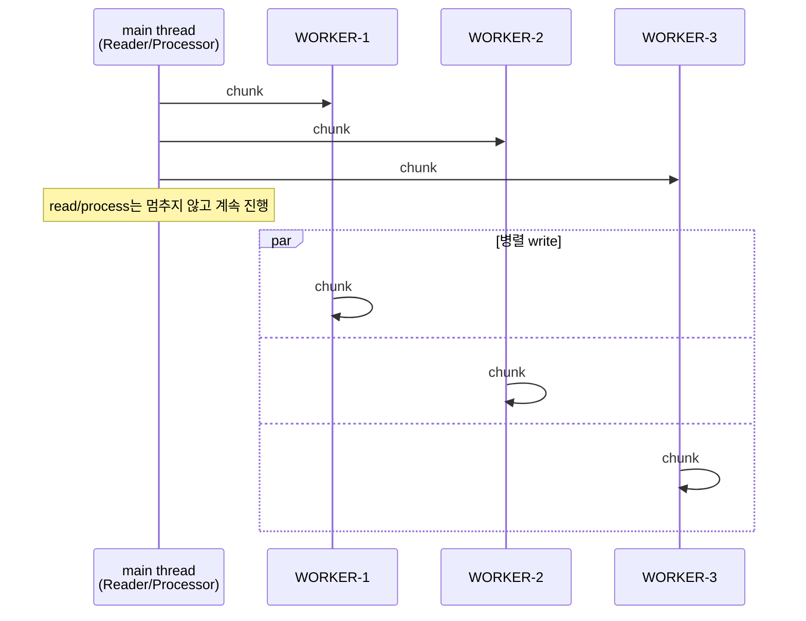
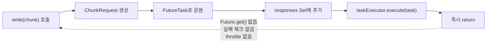
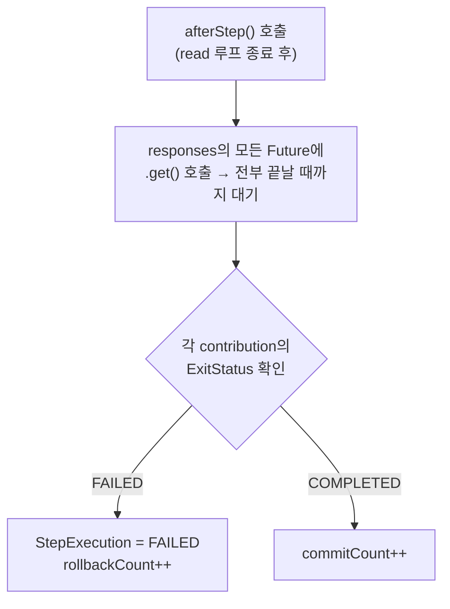
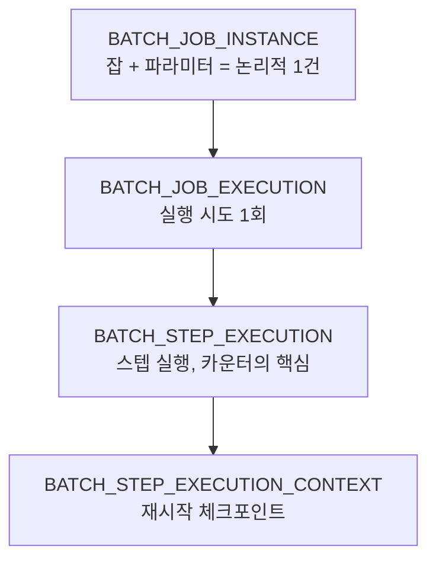
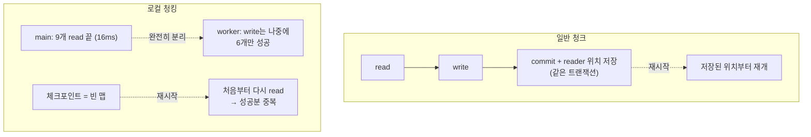
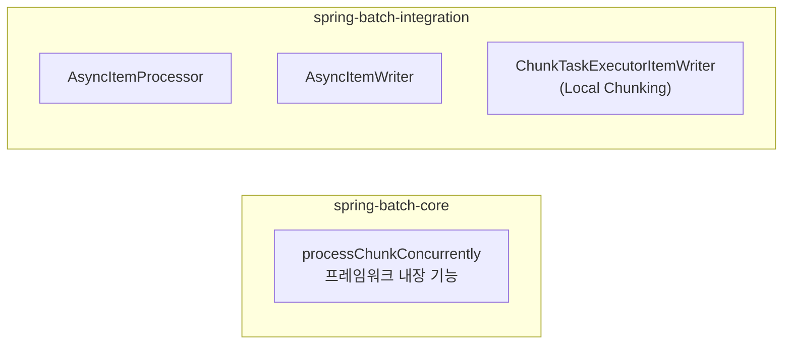

# 서론

데이터 마이그레이션을 다루면서 MySQL `LOAD DATA`로 적재 병목을 풀었던 경험을 이전 글에 적었다.
Read와 Processor는 파티셔닝이나 병렬 처리로 어떻게든 끌어올릴 수 있다. 그런데 결국 마지막에 남는 건 Write다.

외부 쿠폰 발급 API를 호출하거나, 무거운 insert/update를 날리거나, 파일을 만들어서 어딘가로 보내는 작업.
이런 Writer는 read/process가 아무리 빨라도 write 한 번에 수백 ms씩 깔리면 거기서 전체 처리량이 막힌다.

Spring Batch 6은 이 write 병목을 단일 JVM 안에서 풀 수 있는 **Local Chunking**을 새로 들고 나왔다.
이 글에서는 세 가지를 차례로 본다. 먼저 Local Chunking이 어떻게 동작하는지 바이트코드까지 들여다보고, 실패했을 때 왜 복구가 까다로운지를 실제 메타데이터로 확인한 뒤, 마지막으로 이 기능이 왜 하필 `spring-batch-integration` 모듈에 들어가 있는지를 짚는다.
마지막 질문은 내가 직접 Spring Batch 레포에 이슈로 올렸고, 메인테이너가 단 답변을 근거로 정리했다.

---

# 본론

## Local Chunking이 하는 일

일반적인 청크 지향 Step은 이 순서를 청크 단위로 반복한다.

```text
read -> process -> write -> (write 끝날 때까지 대기) -> 다음 chunk
```

write가 느리면 메인 스레드가 매번 거기서 멈춰 선다. Local Chunking은 이 `write`만 떼어내서 워커 스레드로 던진다.
`ChunkTaskExecutorItemWriter`라는 writer를 쓰는데, 이 writer는 실제 쓰기를 하지 않는다. 청크를 받아서 `TaskExecutor`에 제출만 하고 바로 돌아온다.



read/process는 메인 스레드에서 쭉 흐르고, write만 여러 워커에서 동시에 도는 구조다.
write가 병목일 때만 의미가 있고, reader가 느린 상황이라면 Local Chunking이 아니라 reader 튜닝이나 파티셔닝이 먼저다.

## 예제 — 쿠폰 발급 배치

`CouponTarget`을 읽어 `IssuedCoupon`으로 만들고, 느린 writer가 발급한다고 가정했다.
Step 설정은 일반 청크 Step과 거의 같다. writer 자리에 비동기 writer를 꽂는 것만 다르다.

```java
@Bean
public Step localChunkingStep(
        JobRepository jobRepository,
        PlatformTransactionManager transactionManager,
        ItemReader<CouponTarget> couponTargetReader,
        ItemProcessor<CouponTarget, IssuedCoupon> couponIssueProcessor,
        ChunkTaskExecutorItemWriter<IssuedCoupon> localChunkingWriter
) {
    return new StepBuilder("localChunkingStep", jobRepository)
            .<CouponTarget, IssuedCoupon>chunk(3)
            .transactionManager(transactionManager)
            .reader(couponTargetReader)
            .processor(couponIssueProcessor)
            .writer(localChunkingWriter)   // 여기만 비동기 writer
            .build();
}
```

실제 쓰기는 `ChunkProcessor` 안에서 일어나는데, 여기에 `TransactionTemplate`을 손으로 만들어 쓰는 게 눈에 띈다.

```java
@Bean
public ChunkProcessor<IssuedCoupon> localChunkProcessor(
        PlatformTransactionManager transactionManager,
        ItemWriter<IssuedCoupon> couponWriter
) {
    TransactionTemplate transactionTemplate = new TransactionTemplate(transactionManager);
    return (chunk, contribution) -> transactionTemplate.executeWithoutResult(status -> {
        try {
            couponWriter.write(chunk);
            contribution.incrementWriteCount(chunk.size());
            contribution.setExitStatus(ExitStatus.COMPLETED);
        } catch (Exception ex) {
            status.setRollbackOnly();
            contribution.setExitStatus(ExitStatus.FAILED.addExitDescription(ex));
        }
    });
}
```

왜 트랜잭션을 직접 감쌀까. Spring 트랜잭션은 `ThreadLocal`에 묶여 있기 때문이다.
메인 스레드가 시작한 Step 트랜잭션은 워커 스레드로 따라오지 않는다. 그래서 워커에서 도는 실제 write는 그 스레드 안에서 트랜잭션을 새로 열어줘야 한다.
워커가 3개면 트랜잭션도 3개, 각자 따로 커밋되고 따로 롤백된다. 이 사실이 뒤에서 실패 동작을 설명하는 열쇠가 된다.

```java
@Bean
public TaskExecutor localChunkingTaskExecutor() {
    ThreadPoolTaskExecutor executor = new ThreadPoolTaskExecutor();
    executor.setCorePoolSize(3);
    executor.setMaxPoolSize(3);
    executor.setQueueCapacity(10);
    executor.setThreadNamePrefix("LOCAL-CHUNK-WORKER-");
    executor.setWaitForTasksToCompleteOnShutdown(true);
    return executor;
}
```

## 한 청크가 실패하면 뒤 청크는 도는가

5개 청크가 도는 중에 3번이 터지면, 6번 워커는 그대로 도는가? 아니면 Step이 즉시 실패하고 멈추는가?
`ChunkTaskExecutorItemWriter`의 바이트코드를 확인하면 답이 명확하다. (Spring Batch 6.0.3)

`write(chunk)`가 하는 일은 단순하다.



`write()`는 청크를 제출하고 그냥 돌아온다. 이전 청크가 성공했는지 실패했는지 쳐다보지도 않는다.
그래서 메인 스레드의 read → process → write 루프는 중간에 뭐가 터지든 모른 채 끝까지 모든 청크를 제출한다.

실패는 `afterStep()`에서 드러난다. Step의 read 루프가 다 끝난 뒤 한 번 호출된다.



실패는 모든 청크가 제출되고 워커가 전부 끝난 다음, 맨 마지막에 결과를 모으는 단계에서야 잡힌다.
그러니 3번이 터져도 6번은 무조건 돈다. "운 좋으면"이 아니라 구조적으로 항상 돈다. `write()`가 결과를 안 보고 제출만 하니 멈출 방법 자체가 없다.

## 실제로 돌려본 결과

`chunk(3)`, 워커 3개, 데이터 9건으로 실패를 심고 돌렸다.
`memberId=2002`(2번 청크)에서 일부러 예외를 던지게 하고, writer가 진짜 `coupon` 테이블에 insert하게 만들었다.

```text
chunk #1 : 1001, 1002, 1003   (WELCOME)
chunk #2 : 2001, 2002, 2003   (VIP)       <- 2002에서 터짐
chunk #3 : 3001, 3002, 3003   (COMEBACK)
```

로그를 시간순으로 늘어놓으면 앞의 분석이 그대로 찍힌다.

```text
22:12:23.705 [main]      READ/PROCESS 1001 ... 3003   메인이 9개를 다 읽음
22:12:23.715 [main]      Step executed in 16ms        메인 루프는 16ms 만에 끝남
22:12:24.012 [WORKER-2]  WRITE FAIL memberId=2002      2번 청크 폭발
22:12:24.314 [WORKER-1]  WRITE memberId=1003           실패 후에도 다른 워커는 계속 씀
22:12:24.317 [WORKER-3]  WRITE memberId=3003
22:12:24.625 [main]      marking step execution as failed   맨 마지막에야 실패 처리
22:12:24.632 [main]      Job ... status: [FAILED]
```

메인 스레드는 16ms 만에 일을 다 던지고 빠졌다. 그 시점에 write는 시작도 안 했다.
2002가 터진 게 24.012인데 1003, 3003은 그 뒤(24.3xx)에 멀쩡히 써졌고, Step이 FAILED로 찍힌 건 모든 워커가 끝난 24.625다.

### 메타데이터는 어디에 어떻게 쌓이나

Spring Batch는 실행 상태를 메타 테이블에 계층으로 쌓는다.



실행 후 `BATCH_STEP_EXECUTION`을 찍어봤다.

| STATUS | READ | WRITE | COMMIT | ROLLBACK |
|---|---|---|---|---|
| FAILED | 9 | 6 | 2 | 1 |

읽기는 9개 다 됐는데 쓰기는 6개. 1·3번 청크는 커밋(2), 2번 청크는 롤백(1). 이 숫자들은 `afterStep`이 모든 Future를 모아 합산한 결과다.

실제 `coupon` 테이블에는 6건이 남았다.

```text
1001, 1002, 1003, 3001, 3002, 3003
```

여기서 짚을 게 하나 있다. 로그를 보면 2번 청크의 2001은 분명히 insert까지 됐는데 테이블엔 없다.
같은 청크의 2002가 터지면서 `setRollbackOnly()`가 걸렸고, 2001도 같은 트랜잭션이라 통째로 같이 굴러떨어진 것이다. 청크 단위 트랜잭션이라는 게 데이터로 확인되는 순간이다.

### 재시작하면 왜 복구가 안 되나

실패한 잡을 같은 파라미터로 한 번 더 돌렸다. Spring Batch는 같은 잡 인스턴스를 재시작한다.
`BATCH_JOB_EXECUTION`을 보면 인스턴스는 그대로 1번인데 실행만 새로 하나 더 생겼다.

| JOB_EXEC | INSTANCE | STATUS |
|---|---|---|
| 1 | 1 | FAILED (최초) |
| 3 | 1 | FAILED (재시작) |

문제는 재시작한 실행의 카운터다.

| STATUS | READ | WRITE | COMMIT | ROLLBACK |
|---|---|---|---|---|
| FAILED | 9 | 6 | 2 | 1 |

READ가 또 9다. 실패한 2번 청크만 다시 한 게 아니라 처음부터 9개를 전부 다시 읽었다.
그 결과 `coupon` 테이블에는 이미 성공했던 6건이 한 번씩 더 들어갔다.

| member_id | 발급 횟수 |
|---|---|
| 1001 ~ 1003, 3001 ~ 3003 | 각 2번 |
| 총합 | 6건 → 12건 |

성공했던 건 중복으로 쌓이고, 정작 실패한 2002는 두 번째에도 또 터졌다. 재시작을 반복할수록 중복만 늘고 실패 건은 영영 처리되지 않는다.

이유는 `BATCH_STEP_EXECUTION_CONTEXT`를 디코드해보면 나온다. 직렬화된 내용이 빈 맵 `{}`이었다.
"어디까지 처리했다"는 위치 정보가 아예 없다. 일반 청크 Step은 read한 만큼 write하고 커밋할 때 reader 위치까지 같은 트랜잭션에 저장한다. 그래서 재시작하면 이어서 한다.
Local Chunking은 이 연결이 끊어진다.



reader는 메인 스레드에서 16ms 만에 9개를 다 읽고 끝났다. write는 워커에서 reader와 완전히 분리돼 따로 돈다.
그러니 "reader가 어디까지 갔나"와 "어떤 write가 성공했나"를 묶어줄 공통 커밋 지점이 없다. reader는 9개를 다 읽었다고 하는데 write는 6개만 됐다. 이 둘을 하나로 묶는 트랜잭션이 없으니 저장할 체크포인트도 없다. 그래서 빈 맵이고, 재시작은 무조건 맨 처음으로 돌아간다.

## 왜 `spring-batch-integration` 모듈에 있나

기능을 들여다보다 한 가지가 걸렸다. Local Chunking은 외부 시스템도, 메시지 브로커도, Spring Integration 의존성도 쓰지 않는다. 그냥 `TaskExecutor`로 단일 JVM 안에서 도는 기능이다.
그런데 왜 이름부터 통합을 뜻하는 `spring-batch-integration` 모듈에 들어가 있을까? 비슷하게 `TaskExecutor`를 쓰는 아이템 단위 동시성(`ChunkOrientedStep`의 `processChunkConcurrently`)은 `spring-batch-core`에 있는데 말이다.

이 의문을 Spring Batch 레포에 이슈로 올렸고, 리드 메인테이너 Mahmoud Ben Hassine이 직접 답을 달았다. 핵심을 정리하면 이렇다.


먼저 비교 대상이 잘못됐다. `processChunkConcurrently`는 **프레임워크에 내장된 기능**이고, Local Chunking이나 `AsyncItemProcessor`/`AsyncItemWriter`는 **사용자가 프레임워크 동작을 커스터마이즈하려고 끼워 넣는 API**다. 성격이 다르다.



그리고 `AsyncItemProcessor`, `AsyncItemWriter`는 이름과 달리 Spring Integration과 아무 관련이 없는데도 예전부터 integration 모듈에 있었다.
메인테이너는 Local Chunking을 새로 넣으면서 **비동기 처리 API들을 한 모듈에 모아두고 싶었다.** 그래서 기존 Async 계열 옆, 즉 integration 모듈에 둔 것이다.
모듈 이름이 integration이긴 하지만 그가 보기엔 이건 Spring Integration 전용이라기보다 일반적인 통합 패턴을 담는 자리에 가깝다는 설명이었다.

흥미로운 건 그다음이다. 그는 v6를 작업하며 두 가지 선택지를 두고 고민했다고 한다.

1. `AsyncItemProcessor`/`AsyncItemWriter`를 core로 옮기고 Local Chunking도 core에 넣는다.
2. Async 계열을 integration에 그대로 두고 Local Chunking도 그 옆 integration에 넣는다.

결과적으로 2번을 골랐지만, **돌이켜보니 1번이 맞았던 것 같다**고 스스로 인정했다.
그러면서 이슈를 다시 열었다. 사용자가 Local Chunking이나 Async 계열을 쓰려고 굳이 `spring-batch-integration`과 그 전이 의존성 전부를 끌어와야 하는 건 곤란하기 때문이다.
실제로 이 논의를 계기로 해당 클래스들을 core로 옮기는 PR(#5409)이 올라와 진행 중이다. 동작 변경 없이 모듈 위치만 바꾸는 작업이다.

정리하면, Local Chunking이 integration 모듈에 있는 건 기술적 필연이 아니라 **"비동기 처리 API는 한곳에 모은다"는 당시의 배치 결정** 때문이었다. 그리고 그 결정은 지금 core 쪽으로 정정되는 중이다.

---

# 결론

Local Chunking은 write 병목을 단일 JVM 안에서 비교적 싸게 푸는 도구다. 코드 몇 줄로 write를 병렬화할 수 있다는 건 분명한 장점이다.

대신 실패와 재시작 모델을 일반 청크와 똑같이 생각하면 데이터가 망가진다. 원인은 막연히 "스레드가 달라서"가 아니다.
reader의 진행과 write의 커밋이 비동기로 분리돼서 둘을 묶는 일관된 체크포인트를 만들 수 없다는 게 본질이다. `read=9 / write=6`이라는 어긋난 카운터와 텅 빈 ExecutionContext가 그걸 그대로 보여준다.

그래서 실무에서 쓰려면 최소한 이 정도는 먼저 정해야 한다.

- writer를 멱등하게 만든다. UPSERT, 유니크 제약, 처리 전 중복 체크로 재시작해도 중복이 안 생기게 한다.
- 어떤 청크가 실패했는지 비즈니스 테이블에 따로 남기고, 그것만 골라 재처리한다.
- 강한 일관성이 필요하면 Local Chunking 대신 파티셔닝을 본다. 파티셔닝은 파티션마다 독립된 Step과 체크포인트를 가져 재시작이 훨씬 안전하다.

> 내가 올린 이슈와 메인테이너 답변: [Spring Batch #5185](https://github.com/spring-projects/spring-batch/issues/5185#issuecomment-4611200812)
>
> 후속 작업 PR: [spring-batch#5409](https://github.com/spring-projects/spring-batch/pull/5409)
