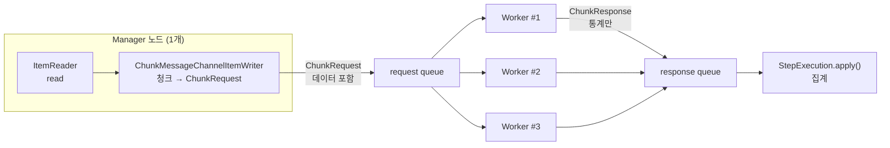
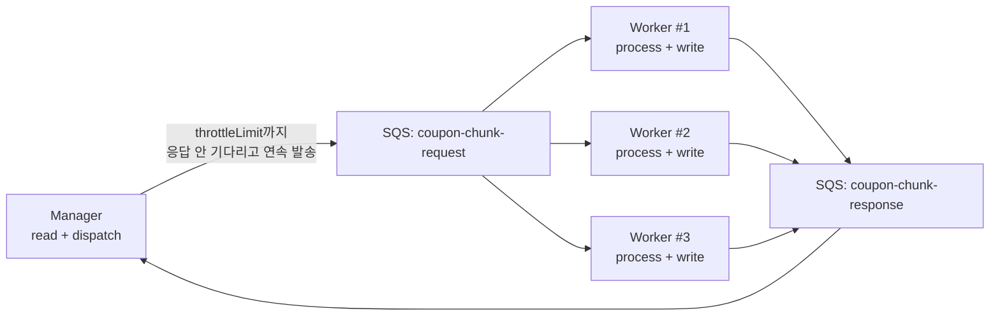
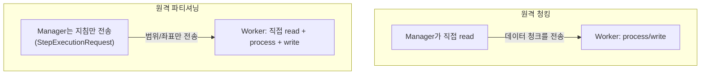

# 서론

지난 글에서 Local Chunking으로 write 병목을 단일 JVM 안에서 풀었다.
`ChunkTaskExecutorItemWriter`가 청크를 워커 스레드에 던지고, read/process는 멈추지 않고 계속 흐르는 구조였다.

그런데 단일 JVM에는 천장이 있다. 코어를 다 쓰고, 스레드 풀을 최대로 올리고, 힙이 가득 차면 거기서 끝이다.
워커 스레드를 더 늘릴 수 없는 순간이 온다. write가 여전히 밀린다면 이제 남은 방향은 하나다. **노드를 넘어서는 것.**

Remote Chunking은 청크를 네트워크 너머 다른 노드로 보내서 처리한다.
Manager가 데이터를 읽어 청크를 메시지로 만들어 보내면, 여러 Worker 노드가 그 청크를 받아 process하고 write한다.
Local Chunking이 write만 떼어 스레드로 분산했다면, Remote Chunking은 **process와 write를 통째로 다른 노드로** 분산한다.

이 글에서는 네 가지를 본다. 먼저 Remote Chunking의 동작을 보고, 그게 사실 Local Chunking과 같은 내부를 공유한다는 점을 짚는다.
그다음 전달 계층을 AWS SQS로 두었을 때 여러 Worker가 어떻게 청크를 나눠 갖는지(수평 확장), 마지막으로 데이터를 실어 나르는 데서 오는 비용과 재시작 문제, 그리고 원격 파티셔닝과 언제 갈라지는지를 정리한다.

> 미리 밝혀둔다. Spring Batch의 원격 청킹 배선과 ChunkRequest/Response 왕복·집계는 로컬에서 인-프로세스 브로커로 직접 돌려 검증했다.
> SQS는 그 검증된 구조에서 **전달 계층만 교체**한 형태로 서술한다. 뒤에서 보겠지만, 전달 계층이 무엇이냐는 사실 이 패턴의 본질이 아니다.

---

# 본론

## Remote Chunking이 하는 일

역할이 둘로 갈린다.

- **Manager**: 데이터를 직접 읽는다(read). 청크 단위로 묶어 `ChunkRequest`로 만들어 큐로 보낸다. = 청크 제공자
- **Worker**: 큐에서 청크를 받아 process하고 write한다. 결과 통계를 `ChunkResponse`로 회신한다. = 청크 처리자

핵심은 두 메시지가 비대칭이라는 점이다.

```text
ChunkRequest    Manager → Worker.  처리할 "데이터 청크 자체"를 싣는다 (items 필드)
ChunkResponse   Worker → Manager.  처리 "결과 통계"(StepContribution)만 싣는다
```

가는 메시지는 데이터를 싣고 무겁고, 오는 메시지는 통계만 싣고 가볍다. 이 비대칭이 뒤에서 비용 이야기로 이어진다.



Manager 스텝은 `RemoteChunkingManagerStepBuilderFactory`로 만든다. 여기에는 processor도 writer도 지정하지 않는다.

```java
@Bean
public Step remoteChunkingManagerStep(
        RemoteChunkingManagerStepBuilderFactory managerStepBuilderFactory,
        ItemReader<CouponTarget> remoteCouponTargetReader
) {
    return managerStepBuilderFactory.get("remoteChunkingManagerStep")
            .<CouponTarget, IssuedCoupon>chunk(3)
            .reader(remoteCouponTargetReader)            // Manager가 읽는다
            .outputChannel(managerRequestChannel())      // ChunkRequest 발송 채널
            .inputChannel(managerReplyChannel())         // ChunkResponse 수신 채널
            .build();
}
```

writer를 안 꽂는 이유는, 빌더가 내부적으로 `ChunkMessageChannelItemWriter`를 ItemWriter 자리에 자동으로 넣기 때문이다.
이 writer는 DB에 쓰지 않는다. 읽은 청크를 `ChunkRequest`로 포장해 `outputChannel`로 보내고, 모든 `ChunkResponse`가 돌아올 때까지 기다렸다가 `StepExecution`에 통계를 합산한다.

Worker는 스텝이 아니라 `IntegrationFlow`를 만든다.

```java
@Bean
public IntegrationFlow remoteChunkingWorkerFlow(
        RemoteChunkingWorkerBuilder<CouponTarget, IssuedCoupon> workerBuilder,
        ItemProcessor<CouponTarget, IssuedCoupon> targetingProcessor,
        ItemWriter<IssuedCoupon> remoteCouponWriter
) {
    return workerBuilder
            .inputChannel(workerRequestChannel())     // ChunkRequest 받을 채널
            .outputChannel(workerReplyChannel())       // ChunkResponse 보낼 채널
            .itemProcessor(targetingProcessor)         // process도 Worker에서
            .itemWriter(remoteCouponWriter)            // write도 Worker에서
            .build();
}
```

Worker가 스텝을 직접 실행하지 않는다는 게 중요하다. Worker는 들어온 메시지에 대해 process/write만 하고 결과를 채널로 돌려보낸다.

## 사실은 Local Chunking과 같은 뿌리다

Local Chunking 글의 마지막에 `ChunkTaskExecutorItemWriter` 내부를 까보면 `ChunkProcessorChunkHandler.handle()`을 부른다고 적었다.
그 핸들러가 바로 여기, Remote Chunking의 Worker가 쓰는 그 클래스다.

```mermaid
flowchart TB
    subgraph RC["원격 청킹"]
        RA["ChunkRequest"] -->|메시지 큐| RB["Worker 노드"]
        RB --> RH["ChunkProcessorChunkHandler.handle()"]
        RH --> RP["SimpleChunkProcessor"]
        RP --> RR["ChunkResponse"]
    end
    subgraph LC["로컬 청킹"]
        LA["ChunkRequest"] -->|TaskExecutor| LB["Worker 스레드"]
        LB --> LH["ChunkProcessorChunkHandler.handle()"]
        LH --> LP["ChunkProcessor"]
        LP --> LR["ChunkResponse"]
    end
```



공통은 `ChunkProcessorChunkHandler`, `ChunkRequest`/`ChunkResponse`, `handle()` 호출 방식이다.
다른 건 단 하나, **전달 계층**이다. 원격은 메시지 큐(네트워크)를 거치고, 로컬은 `TaskExecutor`(스레드 풀)를 거친다.

Local Chunking은 Spring Batch 6에서 새로 들어온 기능이고, Remote Chunking은 예전부터 있던 검증된 메커니즘이다.
팀은 새 기능을 만들 때 이미 검증된 원격 청킹의 내부를 그대로 재사용하고, 큐를 스레드 풀로 바꾸기만 했다.
그래서 둘은 표면이 다를 뿐 같은 뿌리에서 나온 형제다.

이 사실이 실무에 주는 함의는 분명하다. **전달 계층은 갈아 끼울 수 있는 부품이다.** 스레드든, 인-프로세스 브로커든, Kafka든, SQS든, 청크 처리 코어는 그대로다.
그래서 나는 로컬에서 인-프로세스 브로커로 왕복을 먼저 검증하고, 운영 전달 계층으로는 우리 인프라에 이미 있는 SQS를 택했다.

## 전달 계층을 SQS로 — Worker 수평 확장

SQS는 이 패턴과 궁합이 좋다. 큐 하나를 여러 컨슈머가 폴링하면 메시지가 자연스럽게 나눠진다. 이게 **경쟁 소비자(competing consumers)** 패턴이고, 곧 청크가 여러 Worker로 분산된다는 뜻이다.



여기서 두 가지가 동시에 맞물려야 병렬이 산다.

하나는 Manager 쪽 `throttleLimit`이다. `ChunkMessageChannelItemWriter`는 응답이 올 때까지 멈추지 않고, 한도(기본 6)까지 청크를 미리 발송한다.
응답을 기다리며 한 청크씩만 보낸다면 Worker가 아무리 많아도 한 번에 하나만 돈다. throttle 덕에 여러 청크가 큐에 동시에 떠 있고, 그래야 Worker들이 동시에 가동된다.

다른 하나는 Worker 수다. Worker 노드(또는 컨슈머 스레드)가 N개면 큐에서 N개 청크가 동시에 빠진다.
Manager는 read/dispatch만 하니 가볍고, 무거운 process/write가 N배로 퍼진다. 이게 수평 확장의 실체다.

전달 계층은 Spring Batch 코어를 건드리지 않고 채널 양 끝에 SQS 송수신만 붙이면 된다.
ChunkRequest/Response는 `Serializable`이므로, 직렬화해서 SQS 본문(텍스트)에 싣고 받는 쪽에서 복원한다.

```java
// Manager: outputChannel 의 ChunkRequest 를 직렬화해 SQS 요청 큐로 발송
@Bean
public IntegrationFlow managerOutboundFlow(SqsTemplate sqsTemplate) {
    return IntegrationFlow.from(managerRequestChannel())
            .handle(msg -> sqsTemplate.send(to -> to
                    .queue("coupon-chunk-request")
                    .payload(encode(msg.getPayload()))))   // Serializable → Base64
            .get();
}

// Worker: SQS 요청 큐를 폴링해 복원 후 worker 입력 채널로 전달
@SqsListener("coupon-chunk-request")
public void onChunkRequest(String body) {
    workerRequestChannel().send(new GenericMessage<>(decode(body)));
}
```

응답 방향(Worker → response 큐 → Manager)도 대칭으로 똑같이 둔다.
운영에서 노드를 나눌 때는 `remote-chunking-manager` / `remote-chunking-worker` 프로파일로 빈을 갈라, Worker 프로세스를 원하는 수만큼 띄우면 컨슈머가 늘어 분산된다.

### SQS라서 더 챙겨야 하는 것

SQS 위에 올리면 SQS의 운영 특성이 그대로 따라온다. 원격 청킹에서 특히 걸리는 셋만 보자.

- **Visibility Timeout** — Worker가 청크 하나를 process/write하는 시간이 visibility timeout보다 길면, SQS는 그 메시지가 죽은 줄 알고 다른 Worker에게 또 준다. 같은 청크가 두 번 처리된다.
  청크 크기와 건당 처리 시간을 곱한 값보다 visibility timeout을 넉넉히 잡아야 한다.
- **메시지 256KB 한도** — ChunkRequest는 데이터를 싣는다. SQS 본문은 최대 256KB다. 청크 크기 × 아이템 직렬화 크기가 이 한도를 넘으면 안 된다.
  즉 SQS에서는 **chunk 크기가 데이터 크기에 묶인다.** 크면 청크를 잘게 쪼개거나, 본문엔 키만 싣고 데이터는 S3에 두는 방식을 고려해야 한다.
- **DLQ** — 특정 청크가 계속 실패하면(poison chunk) visibility timeout마다 무한히 재시도된다. DLQ를 붙여 일정 횟수 초과분을 격리하고, 그 청크만 따로 재처리한다.

## 데이터를 실어 나르는 비용, 그리고 재시작

원격 청킹의 가장 큰 단점은 **데이터를 직접 전송한다는 것** 그 자체다.

- **네트워크/직렬화 비용** — ChunkRequest의 `items`가 직렬화되어 네트워크를 건넌다. 건수가 많거나 객체가 크면 전송 자체가 병목이 된다.
  Worker의 process/write가 충분히 무거워서 전송 비용을 상쇄할 때만 이득이다. 가벼운 처리라면 굳이 데이터를 멀리 보낼 이유가 없다.
- **Manager 읽기 병목** — 읽기는 Manager 혼자 한다. read가 느리면 Worker를 아무리 늘려도 소용없다. 이 경우엔 원격 청킹이 답이 아니다.
- **직렬화 가능성** — 청크에 담기는 도메인 객체가 `Serializable`이어야 한다. 이걸 놓치면 런타임에 직렬화 예외로 터진다.

```java
public record CouponTarget(
        Long memberId, String campaign, int discountRate
) implements Serializable {}
```

재시작은 더 조심해야 한다. SQS는 기본이 **at-least-once 전달**이다. 위의 visibility timeout 사례처럼 같은 청크가 중복 전달될 수 있다.
그리고 원격 청킹의 실패/재시작 모델도 일반 청크 스텝처럼 깔끔하지 않다. read의 진행과 원격 write의 완료가 비동기로 분리돼 있어서, Local Chunking 글에서 본 "어긋난 카운터" 문제가 여기서도 똑같이 생긴다.

결론은 하나로 모인다. **writer를 멱등하게 만든다.** UPSERT, 유니크 제약, 처리 전 중복 체크 중 하나로 같은 청크가 두 번 와도 데이터가 깨지지 않게 해야 한다.
이건 원격 청킹의 권장 사항이 아니라 SQS at-least-once 위에서는 사실상 전제 조건이다.

## 원격 청킹 vs 원격 파티셔닝

둘 다 분산 처리지만 갈라지는 지점이 분명하다. **누가 데이터를 읽느냐**다.



| 구분 | 원격 청킹 | 원격 파티셔닝 |
| --- | --- | --- |
| 읽기 주체 | Manager 한 곳 | 각 Worker가 자기 구역을 직접 |
| 전송 내용 | 데이터 청크(items) | 작업 지침(파티션 범위) |
| 네트워크 부하 | 데이터를 실어 큼 | 지침만 실어 작음 |
| 병목 위험 | Manager 읽기 | 거의 없음(읽기 분산) |
| 적합 상황 | read는 빠른데 process/write가 무거움 | read 자체가 무겁거나 분할 가능 |

읽기가 빠르고 처리가 무거우면 원격 청킹, 읽기 자체가 무겁고 데이터를 범위로 나눌 수 있으면 원격 파티셔닝이다.
SQS 256KB 한도까지 고려하면, 데이터가 큰 작업은 청킹보다 파티셔닝(키/범위만 전송) 쪽으로 기우는 경우가 많다.

---

# 결론

Remote Chunking은 Local Chunking이 단일 JVM에서 멈춘 지점을 노드 너머로 끌고 나간다.
process/write를 여러 Worker로 퍼뜨려 수평 확장하는 도구이고, 그 핵심은 의외로 단순하다. **검증된 청크 처리 코어는 그대로 두고 전달 계층만 갈아 끼운다.**
그래서 스레드(로컬)든 SQS(원격)든 같은 `ChunkProcessorChunkHandler` 위에서 돈다.

대신 데이터를 실어 나르는 패턴이라 대가가 따른다.

- 전송/직렬화 비용이 있어 process/write가 충분히 무거울 때만 이득이다. 가벼운 처리는 데이터를 멀리 보낼 이유가 없다.
- Manager 읽기가 병목이면 효과가 없다. 그땐 원격 파티셔닝을 본다.
- SQS 위에서는 visibility timeout, 256KB 한도, DLQ를 반드시 설계에 넣고, at-least-once를 전제로 **writer를 멱등하게** 만든다.

도입을 정한다면 이 순서로 점검하면 된다. ① process/write가 정말 무거운가(전송 비용을 상쇄하는가) → ② read가 병목은 아닌가(맞다면 파티셔닝) → ③ 청크 데이터가 256KB 안에 드는가 → ④ writer가 멱등한가.
이 넷이 다 통과해야 원격 청킹이 제값을 한다.

> 이 글의 예제 코드와 흐름은 단일 JVM 프로토타입으로 검증한 것이다. 운영에서 실제 수평 확장을 보려면 Worker 프로세스를 노드 수만큼 띄워 SQS 컨슈머를 늘리면 된다.
