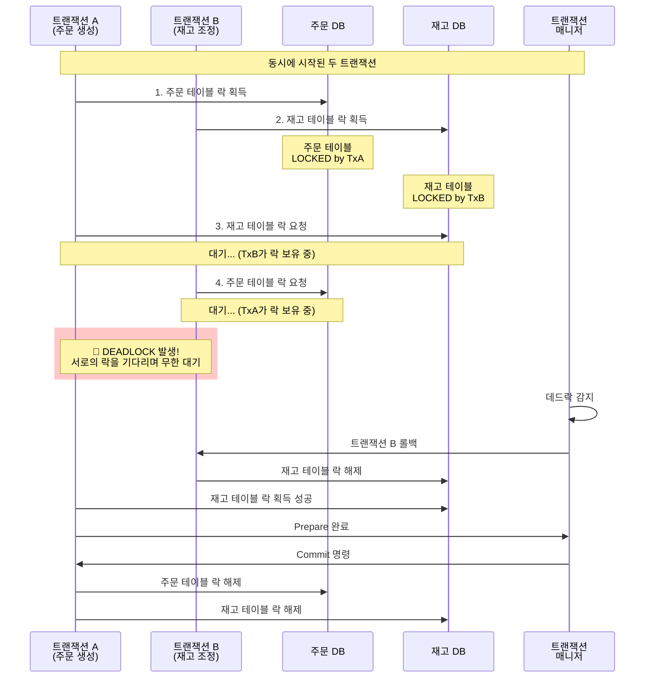

## 2PC (Two-Phase Commit)

최근 마이크로서비스 아키텍처가 보편화되면서 하나의 비즈니스 로직이 여러 서비스에 걸쳐 실행되는 경우가 많아졌다. 이때 가장 골치 아픈 문제 중 하나가 바로 **분산 트랜잭션**이다.

### 왜 2PC가 필요할까?

일반적인 단일 데이터베이스 환경에서는 트랜잭션의 ACID 속성이 자동으로 보장된다. 하지만 여러 데이터베이스나 시스템에 걸쳐 작업을 수행할 때는 상황이 복잡해진다.

실제 온라인 쇼핑몰을 예로 들어보자:

```
주문 처리 과정:
1. 주문 정보를 주문 DB에 저장
2. 재고를 재고 DB에서 차감  
3. 결제를 결제 시스템에서 처리
4. 포인트를 회원 DB에서 적립
```

만약 3번 결제 처리에서 실패한다면? 1, 2번은 이미 완료되었지만 4번은 실행되지 않는 **부분 실패** 상황이 발생한다. 고객은 돈만 빠져나가고 상품은 받지 못하는 최악의 시나리오다.

2PC는 이런 상황에서 "전부 성공하거나, 전부 실패하거나" 둘 중 하나만 일어나도록 보장하는 프로토콜이다.

### 2PC 프로세스


#### Phase 1: Prepare (준비 단계)

1. **트랜잭션 매니저(Coordinator)**가 모든 참여자(Participant)에게 `PREPARE` 메시지를 전송한다.
2. 각 참여자는 실제 작업을 수행하지만 **커밋하지는 않는다**.
3. 참여자는 작업이 성공적으로 준비되면 `YES` 응답을, 실패하면 `NO` 응답을 보낸다.
4. 이 단계에서 참여자는 트랜잭션 로그를 기록하여 장애 복구에 대비한다.

```java
// 실제 주문 시스템에서 재고 차감 준비 과정
public int prepare(Xid xid) throws XAException {
    try {
        // 재고 차감 작업을 수행하지만 아직 커밋하지 않음
        connection.setAutoCommit(false);
        
        PreparedStatement checkStmt = connection.prepareStatement(
            "SELECT quantity FROM inventory WHERE product_id = ? FOR UPDATE");
        checkStmt.setLong(1, productId);
        ResultSet rs = checkStmt.executeQuery();
        
        if (rs.next() && rs.getInt("quantity") >= orderQuantity) {
            PreparedStatement updateStmt = connection.prepareStatement(
                "UPDATE inventory SET quantity = quantity - ? WHERE product_id = ?");
            updateStmt.setInt(1, orderQuantity);
            updateStmt.setLong(2, productId);
            updateStmt.executeUpdate();
            
            return XA_OK; // 재고 차감 준비 완료
        } else {
            return XA_RBROLLBACK; // 재고 부족으로 실패
        }
    } catch (SQLException e) {
        log.error("재고 차감 준비 중 오류 발생", e);
        return XA_RBROLLBACK;
    }
}
```

#### Phase 2: Commit/Abort (실행 단계)

1. 트랜잭션 매니저가 모든 참여자로부터 `YES` 응답을 받으면 `COMMIT` 메시지를 전송한다.
2. 하나라도 `NO` 응답을 받거나 타임아웃이 발생하면 `ABORT` 메시지를 전송한다.
3. 참여자들은 해당 명령에 따라 실제 커밋 또는 롤백을 수행한다.

```java
// 재고 차감 최종 확정 단계
public void commit(Xid xid, boolean onePhase) throws XAException {
    try {
        connection.commit(); // Prepare 단계에서 수행한 재고 차감을 확정
        log.info("상품 ID {}의 재고 {}개 차감 완료", productId, orderQuantity);
        
        // 트랜잭션 로그 정리
        clearTransactionLog(xid);
    } catch (SQLException e) {
        log.error("재고 차감 커밋 실패: 상품 ID {}", productId, e);
        throw new XAException("재고 차감 커밋 실패");
    }
}

public void rollback(Xid xid) throws XAException {
    try {
        connection.rollback(); // Prepare 단계에서 수행한 작업을 모두 취소
        log.info("상품 ID {}의 재고 차감 롤백 완료", productId);
    } catch (SQLException e) {
        log.error("재고 차감 롤백 실패: 상품 ID {}", productId, e);
        throw new XAException("재고 차감 롤백 실패");
    }
}
```

### 2PC의 한계점

- **성능 오버헤드**: 모든 참여자가 응답할 때까지 대기해야 하므로 지연시간이 증가한다.
- **단일 장애점**: 트랜잭션 매니저에 장애가 발생하면 전체 시스템이 블록될 수 있다.
- **네트워크 분할**: 네트워크 문제로 일부 참여자와 통신이 불가능한 경우 처리가 복잡해진다.
- **장기간 락 점유로 인한 데드락 위험**: 2PC는 여러 데이터베이스 리소스를 장시간 잠그고 있어 데드락 발생 가능성이 높다.

#### 데드락 발생 시나리오

2PC 환경에서는 트랜잭션이 여러 데이터베이스의 리소스를 동시에 점유하고, Prepare 단계에서 Commit까지 오랜 시간 락을 유지하기 때문에 데드락이 발생하기 쉽다.

**실제 상황 예시:**
- 트랜잭션 A: 주문 생성 (주문 DB → 재고 DB 순서로 접근)
- 트랜잭션 B: 재고 조정 (재고 DB → 주문 DB 순서로 접근)



#### 2PC에서 데드락이 더 위험한 이유

**1. 긴 락 점유 시간**
```java
// 단일 DB 트랜잭션: 빠른 처리
@Transactional
public void updateStock(Long productId, int quantity) {
    stockRepository.updateQuantity(productId, quantity);
    // 락 점유 시간: 보통 10-50ms
}

// 2PC 분산 트랜잭션: 오랜 락 점유
@Transactional("jtaTransactionManager")  
public void processOrderWithDistributedTx(Order order) {
    // 1. 주문 DB에서 락 획득
    orderRepository.save(order);
    
    // 2. 재고 DB에서 락 획득 (주문 DB 락 유지한 채)
    stockRepository.decreaseStock(order.getProductId(), order.getQuantity());
    
    // 3. 결제 시스템 호출 (모든 락 유지한 채 네트워크 통신 대기)
    paymentService.charge(order.getPaymentInfo());
    
    // 락 점유 시간: 수 초에서 수십 초 (네트워크 지연 + 다른 시스템 응답 시간)
}
```

**2. 여러 리소스 동시 점유**
```java
// 실제 운영 환경에서 자주 마주치는 데드락 시나리오
@Transactional("jtaTransactionManager") 
public void cancelOrder(Long orderId) {
    // A 트랜잭션: 주문 취소 (주문 → 재고 순서)
    Order order = orderRepository.findById(orderId);
    order.cancel(); // 주문 테이블 락 획득
    
    stockRepository.restoreStock(order.getProductId(), order.getQuantity()); // 재고 테이블 락 획득
}

@Transactional("jtaTransactionManager")
public void adjustInventory(Long productId, int newQuantity) {
    // B 트랜잭션: 재고 조정 (재고 → 주문 순서) 
    stockRepository.updateQuantity(productId, newQuantity); // 재고 테이블 락 획득
    
    // 해당 상품의 대기 중인 주문들 처리
    List<Order> pendingOrders = orderRepository.findPendingByProductId(productId); // 주문 테이블 락 요청
    // ... 처리 로직
}

// A와 B가 동시에 실행되면?
// A: 주문 테이블 락 → 재고 테이블 락 요청 (B가 점유중이라 대기)
// B: 재고 테이블 락 → 주문 테이블 락 요청 (A가 점유중이라 대기)
// 결과: 데드락!
```


이러한 이유로 2PC는 강한 일관성이 반드시 필요한 경우가 아니라면 Saga 패턴이나 이벤트 기반 아키텍처 같은 대안을 고려하는 것이 좋다.

## Atomikos

Atomikos는 Java 환경에서 분산 트랜잭션을 구현할 수 있게 해주는 오픈소스 JTA(Java Transaction API) 구현체다. 복잡한 XA 트랜잭션 관리를 간단하게 만들어주는 역할을 한다.

### Atomikos의 주요 특징

#### 1. 경량화된 트랜잭션 매니저
기존의 무거운 애플리케이션 서버 없이도 분산 트랜잭션을 사용할 수 있다. Spring Boot와 같은 임베디드 환경에서도 쉽게 통합 가능하다.

#### 2. 자동 복구 기능
시스템 장애 발생 시 미완료 트랜잭션을 자동으로 감지하고 복구한다. 트랜잭션 로그를 통해 장애 발생 전 상태를 파악하고 적절한 복구 작업을 수행한다.

#### 3. 다양한 리소스 지원
- 데이터베이스 (MySQL, PostgreSQL, Oracle 등)
- 메시지 큐 (ActiveMQ, RabbitMQ 등)
- 파일 시스템

### Spring Boot에서 Atomikos 사용하기

```gradle
implementation group: 'com.atomikos', name: 'transactions-spring-boot3-starter', version: '6.0.0'

implementation group: 'jakarta.transaction', name: 'jakarta.transaction-api', version: '2.0.1'
```


```java
@Configuration
@EnableTransactionManagement
public class JtaDataSourceConfig {

    @Value("${server.port}")
    private String serverPort;

    @Bean(initMethod = "init", destroyMethod = "close")
    public UserTransactionManager userTransactionManager() {
        System.setProperty("com.atomikos.icatch.log_base_name", "tmlog-" + serverPort);
        System.setProperty("com.atomikos.icatch.tm_unique_name", "name-" + serverPort + "-tm");
        UserTransactionManager userTransactionManager = new UserTransactionManager();
        userTransactionManager.setForceShutdown(false);
        return userTransactionManager;
    }

    @Bean
    public UserTransaction userTransaction() throws SystemException {
        UserTransactionImp userTransactionImp = new UserTransactionImp();
        userTransactionImp.setTransactionTimeout(200);
        return userTransactionImp;
    }

    @Bean("transactionManager")
    @Primary
    public PlatformTransactionManager transactionManager() throws SystemException {
        JtaTransactionManager jtaTransactionManager = new JtaTransactionManager();
        jtaTransactionManager.setUserTransaction(userTransaction());
        jtaTransactionManager.setTransactionManager(userTransactionManager());
        return jtaTransactionManager;
    }

    @Bean("primaryDataSource")
    @Primary
    public DataSource primaryDataSource() {
        AtomikosDataSourceBean dataSourceBean = new AtomikosDataSourceBean();
        dataSourceBean.setUniqueResourceName("primary-db");
        dataSourceBean.setXaDataSourceClassName("com.mysql.cj.jdbc.MysqlXADataSource");

        Properties props = new Properties();
        props.put("url", "");
        props.put("user", "");
        props.put("password", "");
        dataSourceBean.setXaProperties(props);

        dataSourceBean.setMaxPoolSize(10);
        dataSourceBean.setMinPoolSize(5);
        return dataSourceBean;
    }

    @Bean("secondaryDataSource")
    public DataSource secondaryDataSource() {
        AtomikosDataSourceBean dataSourceBean = new AtomikosDataSourceBean();
        dataSourceBean.setUniqueResourceName("secondary-db");
        dataSourceBean.setXaDataSourceClassName("com.mysql.cj.jdbc.MysqlXADataSource");

        Properties props = new Properties();
        props.put("url", "");
        props.put("user", "");
        props.put("password", "");
        dataSourceBean.setXaProperties(props);

        dataSourceBean.setMaxPoolSize(10);
        dataSourceBean.setMinPoolSize(5);
        return dataSourceBean;
    }

    @Bean("primarySqlSessionFactory")
    @Primary
    public SqlSessionFactory primarySqlSessionFactory(@Qualifier("primaryDataSource") DataSource dataSource) throws Exception {
        SqlSessionFactoryBean factoryBean = new SqlSessionFactoryBean();
        factoryBean.setDataSource(dataSource);
        factoryBean.setMapperLocations(new PathMatchingResourcePatternResolver()
                .getResources("classpath:/mapper/*.xml"));
        return factoryBean.getObject();
    }

    @Bean("secondarySqlSessionFactory")
    public SqlSessionFactory secondarySqlSessionFactory(@Qualifier("secondaryDataSource") DataSource dataSource) throws Exception {
        SqlSessionFactoryBean factoryBean = new SqlSessionFactoryBean();
        factoryBean.setDataSource(dataSource);
        factoryBean.setMapperLocations(new PathMatchingResourcePatternResolver()
                .getResources("classpath:/mapper/*.xml"));
        return factoryBean.getObject();
    }

    @Bean("primarySqlSessionTemplate")
    @Primary
    public SqlSessionTemplate primarySqlSessionTemplate(@Qualifier("primarySqlSessionFactory") SqlSessionFactory sqlSessionFactory) {
        return new SqlSessionTemplate(sqlSessionFactory);
    }

    @Bean("secondarySqlSessionTemplate")
    public SqlSessionTemplate secondarySqlSessionTemplate(@Qualifier("secondarySqlSessionFactory") SqlSessionFactory sqlSessionFactory) {
        return new SqlSessionTemplate(sqlSessionFactory);
    }
}
```

### 실제 사용 예시

```java
@Service
public class Service {
	@@Transactional(transactionManager = "transactionManager")
	public void method() {
		...db1 로직
		...db2 로직
	}
}
```

이 코드에서 주문 저장과 재고 차감 중 어느 하나라도 실패하면, Atomikos가 2PC 프로토콜을 통해 모든 변경사항을 롤백한다.

### Atomikos 트랜잭션 로그 파일 관리

Atomikos를 사용하면 트랜잭션 복구를 위한 로그 파일들이 생성됩니다:

#### 생성되는 파일들
```
프로젝트 루트/
├── tmlog.lck     # 트랜잭션 매니저 락 파일 (동시 실행 방지)
└── tmlog.log     # 트랜잭션 복구용 로그 파일
```

**파일 역할:**
- `tmlog.lck`: 동일한 트랜잭션 매니저가 중복 실행되는 것을 방지하는 락 파일
- `tmlog.log`: 장애 복구를 위한 미완료 트랜잭션 정보를 저장하는 로그 파일

### Blue-Green 배포 시 파일 락 이슈

Blue-Green 배포나 무중단 배포 환경에서는 같은 서버에 두 개의 애플리케이션 인스턴스가 동시에 실행될 수 있습니다. 이때 Atomikos의 `tmlog.lck` 파일로 인해 다음과 같은 문제가 발생합니다:

#### 문제 상황
```
서버:
├── Blue 버전 (8080 포트) - 기존 실행 중
└── Green 버전 (8081 포트) - 새로 배포

두 애플리케이션이 동일한 tmlog.lck 파일에 접근
→ Green 버전 시작 실패: "Lock file is already in use"
```

#### 오류 로그 예시
```
com.atomikos.icatch.SysException: 
Error in init(): log already in use? 
If not, then delete tmlog.lck and restart.
```

### 해결방법: 포트 기반 파일 분할

각 애플리케이션 인스턴스가 서로 다른 로그 파일을 사용하도록 포트 번호를 기반으로 파일명을 분할합니다:

#### 해결된 파일 구조
```
프로젝트 루트/
├── tmlog-8080.lck    # Blue 버전용 락 파일
├── tmlog-8080.log    # Blue 버전용 로그 파일
├── tmlog-8081.lck    # Green 버전용 락 파일
└── tmlog-8081.log    # Green 버전용 로그 파일
```

#### 구현 코드
```java
@Bean(initMethod = "init", destroyMethod = "close")
public UserTransactionManager userTransactionManager() {
    // 서버 포트를 이용한 고유 파일명 생성
    System.setProperty("com.atomikos.icatch.log_base_name", "tmlog-" + serverPort);
    System.setProperty("com.atomikos.icatch.tm_unique_name", "tm-" + serverPort);
    
    UserTransactionManager userTransactionManager = new UserTransactionManager();
    userTransactionManager.setForceShutdown(false);
    return userTransactionManager;
}
```


### 파일 락(File Lock) 메커니즘

Atomikos가 포트 기반 분할 없이는 동작하지 않는 이유는 **파일 시스템 레벨의 배타적 락(Exclusive Lock)** 때문입니다.

#### 파일 락이 필요한 이유

1. **데이터 무결성 보장**: 여러 프로세스가 동시에 같은 트랜잭션 로그를 수정하면 데이터 손상 발생
2. **트랜잭션 매니저 유일성**: 하나의 트랜잭션 로그에는 하나의 트랜잭션 매니저만 접근해야 함
3. **복구 과정 안전성**: 장애 복구 시 여러 프로세스가 동시에 복구를 시도하면 충돌 발생


### Atomikos vs 다른 해결책

분산 트랜잭션이 항상 최선의 해결책은 아니다. 성능과 복잡성을 고려했을 때 다음과 같은 대안도 검토해볼 만하다:

- **Saga 패턴**: 각 단계별로 보상 트랜잭션을 정의하여 실패 시 이전 단계를 취소
- **Event Sourcing**: 이벤트 기반으로 최종 일관성을 보장
- **Outbox 패턴**: 로컬 트랜잭션과 메시지 발행을 하나의 트랜잭션으로 처리

하지만 강한 일관성이 반드시 필요한 비즈니스 요구사항이 있다면, Atomikos와 2PC는 여전히 유효한 선택지다.
