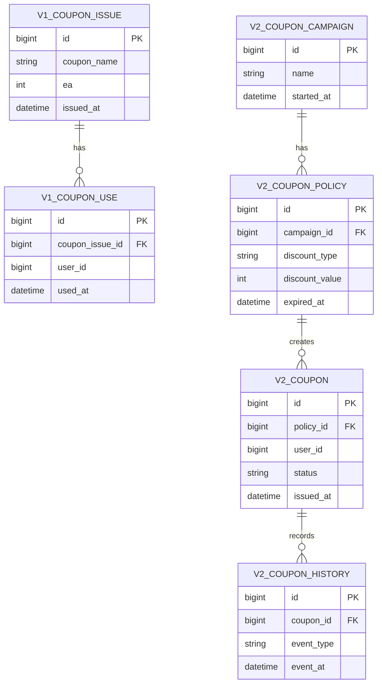
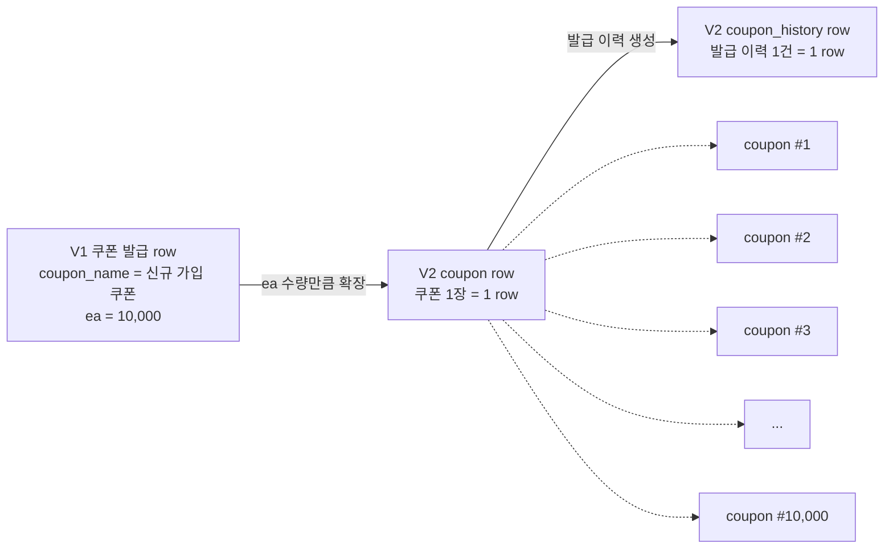
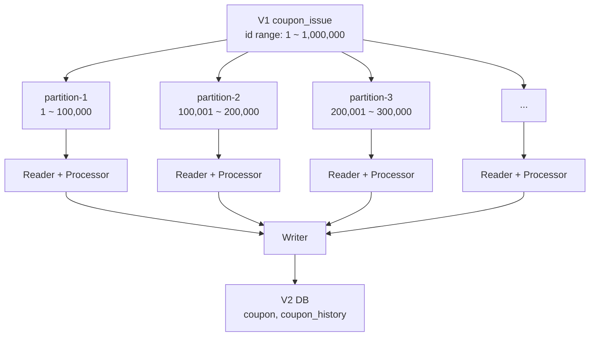
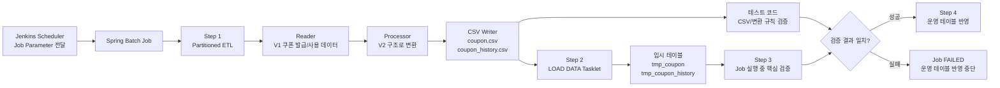
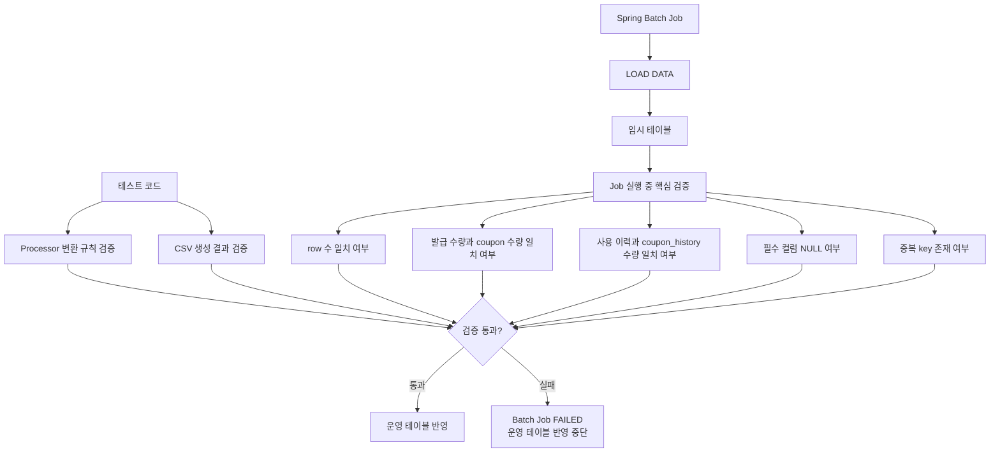
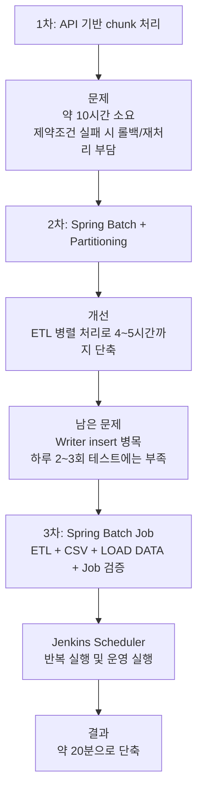

# 서론

---

현업에서 스프링 배치를 사용해서 데이터 마이그레이션을 진행했던 사례를 정리해보려고 합니다.
실제 업무에서 있었던 일을 그대로 적을 수는 없기 때문에, 이 글에서는 **쿠폰 시스템**을 예시로 바꿔서 설명하겠습니다.

마이그레이션을 준비하면서 계속 신경 썼던 부분은 세 가지였습니다.

- **데이터 정합성**: V1 데이터와 V2 데이터가 정확히 일치해야 한다.
- **속도**: 운영 환경에서 수행 가능한 시간 안에 마이그레이션이 끝나야 한다.
- **순서**: 부모 데이터와 자식 데이터, 상태 이력 데이터가 올바른 순서로 생성되어야 한다.

특히 V1과 V2가 같은 데이터베이스 안에서 같이 운영되는 상황이었기 때문에, 마이그레이션이 오래 도는 것 자체가 부담이었습니다.
처음에는 API 기반으로 처리했는데 약 10시간 정도 걸렸고, 마지막에는 Spring Batch Job 안에서 ETL, CSV 생성, MySQL `LOAD DATA`, Job 실행 중 검증, 운영 테이블 반영까지 묶어서 약 20분 수준까지 줄였습니다.
이 Job은 Jenkins 스케줄러와 연결해두었습니다.
테스트 환경에서는 계속 반복 실행했고, 운영 전환 시점에는 파라미터만 바꿔서 같은 Job을 실행했습니다.

# 본론

---

백오피스를 V1에서 V2로 마이그레이션하면서 기존에 불편했던 설계를 다시 잡게 되었고, 이 과정에서 테이블 구조와 비즈니스 로직도 같이 변경되었습니다.

여기서는 쿠폰 시스템을 기준으로 설명하겠습니다.
실제 도메인은 다르지만, 구조는 거의 비슷합니다.

V1에서는 쿠폰 발급 데이터가 **수량 기반**으로 관리된다고 가정하겠습니다.
예를 들어 특정 이벤트로 쿠폰 10,000장을 발급하면, 하나의 row에 쿠폰 종류와 수량이 저장됩니다.

반대로 쿠폰 사용 데이터는 쿠폰이 사용될 때마다 하나의 row가 생기는 구조입니다.
즉, 발급은 수량으로 관리되고, 사용은 개별 이력으로 관리되는 형태였습니다.

## V1 구조

V1 구조를 단순화하면 아래와 같습니다.

| 테이블 | 역할 |
| --- | --- |
| coupon_issue | 쿠폰 발급 정보. 하나의 row에 발급 수량을 저장 |
| coupon_use | 쿠폰 사용 정보. 하나의 row가 하나의 사용 이력 |

예를 들어 `신규 가입 쿠폰 10,000장`을 발급하면 V1에서는 다음과 같은 데이터가 저장됩니다.

| id | coupon_name | ea | issued_at |
| --- | --- | --- | --- |
| 1 | 신규 가입 쿠폰 | 10000 | 2026-06-01 10:00:00 |

그리고 쿠폰이 사용될 때마다 사용 이력 테이블에 데이터가 쌓입니다.

| id | coupon_issue_id | user_id | used_at |
| --- | --- | --- | --- |
| 1 | 1 | 1001 | 2026-06-01 10:10:00 |
| 2 | 1 | 1002 | 2026-06-01 10:20:00 |

단순히 몇 장 발급했고 몇 장 사용했는지 집계만 한다면 큰 문제는 없어 보입니다.
하지만 쿠폰 1장 단위로 상태를 추적해야 하면 이야기가 달라집니다.

예를 들면 이런 질문에 답하기가 애매해집니다.

- 특정 쿠폰 1장이 언제 발급되었는가?
- 어떤 사용자에게 지급되었는가?
- 사용되었는가, 만료되었는가, 취소되었는가?
- 발급 수량과 실제 사용 가능한 쿠폰 수량이 정확히 일치하는가?

## V2 구조

V2에서는 쿠폰을 수량이 아니라 **개별 쿠폰 단위**로 관리하도록 바꿨습니다.

기존에는 `신규 가입 쿠폰 10,000장`이 하나의 row였다면, V2에서는 쿠폰 테이블에 10,000개의 row가 생성됩니다.
그리고 각 쿠폰의 발급, 사용, 만료, 취소 같은 상태 변화는 이력 테이블에 저장됩니다.

| 테이블 | 역할 |
| --- | --- |
| coupon_campaign | 쿠폰 발급 캠페인 정보 |
| coupon_policy | 쿠폰 할인 정책, 유효기간 등 |
| coupon | 개별 쿠폰 정보. 쿠폰 1장 = 1 row |
| coupon_history | 발급, 사용, 만료, 취소 이력 |

그림으로 보면 이런 형태입니다.



결국 V1의 수량 기반 데이터를 V2의 개별 row 기반 데이터로 변환해야 했습니다.



이 작업은 단순히 컬럼을 옮기는 수준이 아니었습니다.
하나의 V1 데이터를 여러 개의 V2 데이터로 펼쳐야 했고, 그래서 일반적인 insert script보다 ETL 성격이 강했습니다.

여기서부터 row 수가 급격히 늘어납니다.
데이터가 `1 row -> 1 row`로 이동하지 않기 때문입니다.
V1에서는 `ea = 10,000`이라는 값 하나로 표현되던 데이터가 V2에서는 실제 coupon row 10,000개로 펼쳐져야 합니다.
그리고 각 coupon row마다 발급 이력을 남겨야 한다면 coupon_history row도 10,000개가 추가로 생성됩니다.

즉, V1의 발급 row 1건이 V2에서는 최소 20,000건 이상의 insert 대상으로 커질 수 있습니다.

| V1 데이터 | V2 변환 결과 |
| --- | --- |
| coupon_issue 1 row, ea = 10,000 | coupon 10,000 rows |
| coupon_issue 1 row, ea = 10,000 | coupon_history 10,000 rows |

결국 이 마이그레이션은 두 가지 일을 동시에 해야 했습니다.

- V1의 수량 기반 데이터를 V2의 개별 row 기반 데이터로 변환하는 ETL 작업
- 변환된 대량 row를 V2 테이블에 insert하는 대량 write 작업

처음에는 이 두 작업을 API 안에서 같이 처리했습니다.
그런데 데이터가 많아질수록 변환해야 할 양도 늘고, insert 해야 할 row 수도 같이 늘었습니다.
이 구조가 뒤에서 계속 문제가 되었습니다.

# 첫 번째 접근: API 기반 Chunk 처리

---

처음에는 API로 마이그레이션을 진행했습니다.

V1 데이터를 조회하고, 일정 개수씩 chunk 단위로 나눈 뒤, V2 API를 호출해서 쿠폰 데이터를 생성하는 방식이었습니다.
V2 API를 태우면 기존 비즈니스 로직과 검증 로직을 그대로 사용할 수 있어서, 처음에는 이 방식이 가장 안전하다고 생각했습니다.

문제는 V2 API가 ETL과 insert를 모두 담당한다는 점이었습니다.
API는 요청을 받으면 V1의 `ea` 수량을 개별 쿠폰 row로 펼치고, coupon과 coupon_history를 저장해야 했습니다.
결국 API 호출 횟수도 문제였지만, 하나의 API 요청 안에서 만들어지는 insert row 수가 많아지는 것도 같이 문제가 됐습니다.

처리 흐름은 아래와 같았습니다.

1. V1 쿠폰 발급 데이터를 조회한다.
2. chunk 단위로 V2 API를 호출한다.
3. V2 API 안에서 발급 수량만큼 개별 쿠폰 데이터를 생성한다.
4. V2 API에서 coupon, coupon_history 데이터를 저장한다.

대량 데이터를 넣고 돌려보니 바로 문제가 보였습니다.

가장 큰 문제는 속도였습니다.
발급 수량이 많아질수록 API 호출 횟수와 DB write 횟수가 급격히 증가했고, 전체 마이그레이션에 약 10시간 정도가 소요되었습니다.

특히 V1의 `ea`가 큰 데이터일수록 하나의 발급 row가 수천, 수만 개의 V2 row로 확장되었습니다.
그래서 chunk 크기를 조절하는 것만으로는 해결이 되지 않았습니다.
API 요청 수를 줄여도 요청 안에서 처리해야 하는 ETL과 insert 양은 그대로 컸기 때문입니다.

실패 처리도 부담이었습니다.
마이그레이션 중간에 컬럼 제약조건이나 데이터 정합성 문제로 실패하는 경우가 있었습니다.
예를 들어 NOT NULL 컬럼에 값이 없거나, 길이 제한을 초과하거나, FK 조건을 만족하지 못하는 데이터가 있을 수 있습니다.

이 경우 트랜잭션 범위에 따라 롤백이 발생하거나, 실패 지점 이후의 데이터를 다시 처리해야 했습니다.
운영 환경에서 10시간 동안 마이그레이션을 돌리고, 실패하면 다시 재처리하는 방식은 현실적으로 부담이 컸습니다.

# 두 번째 접근: Spring Batch 5와 Partitioning

---

API 방식으로는 어렵다고 판단해서 ETL 작업을 API에서 분리했습니다.
그리고 Spring Batch 5로 마이그레이션 배치를 만들었습니다.

방향은 단순했습니다.
V1 데이터를 읽고 V2 구조로 변환하는 작업은 Batch로 빼고, API 요청 안에서 수량을 row로 펼친 뒤 insert까지 하던 구조를 없애고 싶었습니다.

Spring Batch를 선택한 이유는 이렇습니다.

- 대량 데이터를 chunk 단위로 안정적으로 처리할 수 있다.
- 실패 지점을 추적하고 재시작할 수 있다.
- Reader, Processor, Writer 구조로 ETL 흐름을 분리할 수 있다.
- Partitioning을 통해 병렬 처리가 가능하다.

배치 구조는 아래처럼 잡았습니다.

| 단계 | 역할 |
| --- | --- |
| Reader | V1 쿠폰 발급/사용 데이터 조회 |
| Processor | V2 구조에 맞게 coupon, coupon_history 데이터로 변환 |
| Writer | V2 테이블에 데이터 저장 |

처리 속도를 높이기 위해 ID 범위를 기준으로 파티션을 나눴습니다.
각 파티션은 서로 다른 범위의 데이터를 읽고, V2 구조에 맞게 변환했습니다.



이렇게 바꾸니 ETL 속도는 확실히 좋아졌습니다.
API 기반으로 약 10시간 걸리던 작업이 Spring Batch와 Partitioning을 적용한 뒤에는 약 4~5시간 수준으로 줄었습니다.

효과가 있었던 이유는 V1 데이터를 읽고, `ea`를 개별 coupon row와 coupon_history row로 펼치는 ETL 작업을 병렬로 처리할 수 있었기 때문입니다.
API 방식에서는 이 작업이 API 요청 안에서 순차적으로 처리됐습니다.
Batch로 옮긴 뒤에는 Reader, Processor, Writer를 분리하고 파티션 단위로 병렬 실행할 수 있었습니다.

그래도 아직 충분하지 않았습니다.

# 병목은 결국 Write였다

---

Partitioning을 적용하면서 읽고 변환하는 속도는 빨라졌습니다.
그런데 전체 수행 시간은 생각만큼 줄지 않았습니다.

원인은 Writer였습니다.

아무리 Reader와 Processor를 병렬로 빠르게 처리하더라도, 최종적으로 DB에 insert하는 과정에서 병목이 발생했습니다.
특히 V2 구조에서는 하나의 V1 발급 데이터가 여러 개의 coupon row와 coupon_history row로 확장됩니다.

예를 들어 V1에서 쿠폰 10,000장을 발급한 row 하나는 V2에서 최소 10,000개의 coupon row와 10,000개의 coupon_history row로 변환됩니다.
결국 어느 순간부터는 ETL보다 대량 insert 비용이 전체 시간을 잡아먹었습니다.

10시간 걸리던 작업을 4~5시간까지 줄인 것은 의미가 있었지만, 운영 전환을 준비하기에는 여전히 부족했습니다.

마이그레이션 테스트는 한 번만 수행하는 작업이 아닙니다.
데이터 검증, 로직 수정, 재수행을 반복해야 하기 때문에 하루에 2~3번 이상 테스트할 수 있어야 했습니다.
하지만 4~5시간이 걸리면 한 번 실패했을 때 다시 검증하기가 어려웠습니다.

# 세 번째 접근: CSV와 MySQL LOAD DATA

---

그래서 Writer 병목을 해결하는 방향으로 다시 바꿨습니다.

Spring Batch가 DB에 직접 insert하지 않고, V2 구조로 변환한 결과를 CSV 파일로 먼저 저장하게 했습니다.
그리고 같은 Spring Batch Job 안에서 CSV 파일을 MySQL `LOAD DATA`로 임시 테이블에 적재하고, 검증이 통과하면 운영 테이블로 반영하도록 Step을 나눴습니다.

`LOAD DATA`나 검증 SQL을 사람이 따로 실행한 것은 아닙니다.
Spring Batch Job 안에서 하나의 마이그레이션 파이프라인으로 실행했습니다.
변환 규칙과 정합성 조건은 테스트 코드로 먼저 잡고, 실제 Job 실행 중에는 검증 Step을 통해 운영 테이블 반영 여부를 결정했습니다.
Jenkins에서는 이 배치 Job을 정해진 시간에 실행하거나, 테스트할 때 다시 실행할 수 있게 했습니다.

전체 흐름은 아래와 같습니다.



여기서 바로 운영 테이블에 넣지는 않았습니다.
먼저 임시 테이블에 적재한 뒤, CSV 데이터와 임시 테이블 데이터를 비교 검증했습니다.

검증이 통과한 경우에만 실제 운영 테이블로 데이터를 반영했습니다.
이렇게 하면 적재 속도는 `LOAD DATA`로 가져가면서도, 운영 테이블을 건드리기 전에 한 번 더 확인할 수 있습니다.

Spring Batch Job은 크게 네 단계로 나눴습니다.

| Step | 역할 |
| --- | --- |
| Step 1 | V1 데이터를 읽고 V2 구조로 변환한 뒤 CSV 파일 생성 |
| Step 2 | MySQL `LOAD DATA`로 CSV 데이터를 임시 테이블에 적재 |
| Step 3 | V1 원본과 임시 테이블을 비교하는 핵심 검증 수행 |
| Step 4 | 검증 성공 시 임시 테이블 데이터를 운영 테이블로 반영 |

Jenkins에서는 이 Job을 실행하면서 마이그레이션 대상 범위, 실행 환경, CSV 저장 경로 같은 값을 Job Parameter로 전달했습니다.
덕분에 하루에 2~3번 테스트를 반복할 때도 같은 배치 Job을 재사용할 수 있었고, 실패한 경우에는 실패 Step과 검증 결과를 기준으로 원인을 추적할 수 있었습니다.

## 검증 방식

검증은 두 군데로 나눴습니다.

첫 번째는 **테스트 코드**입니다.
Processor가 V1 데이터를 V2 구조로 정확히 변환하는지, CSV row 수가 기대값과 일치하는지, 상태값 매핑이 올바른지 테스트 코드로 검증했습니다.
이 부분은 Job을 계속 돌리기 전에 변환 로직 자체를 빠르게 확인하기 위한 용도였습니다.

두 번째는 **Spring Batch Job 실행 중 검증 Step**입니다.
`LOAD DATA`로 임시 테이블에 적재한 뒤, 운영 테이블에 반영하기 전에 V1 원본 데이터와 임시 테이블 데이터를 비교했습니다.
실제 데이터가 기대한 결과와 맞는지 확인하는 마지막 방어선으로 봤습니다.

운영 테이블에 반영하기 전에 Job에서는 아래 항목을 확인했습니다.

- CSV row 수와 임시 테이블 row 수가 일치하는가?
- V1의 발급 수량과 V2의 coupon 생성 수량이 일치하는가?
- V1의 사용 이력 수와 V2의 coupon_history 수가 일치하는가?
- 필수 컬럼에 NULL 데이터가 없는가?
- 중복 key가 존재하지 않는가?
- 상태값이 정상적으로 매핑되었는가?

검증 흐름은 이렇게 잡았습니다.



이 방식으로 바꾼 뒤 전체 마이그레이션 시간은 약 20분 수준까지 줄었습니다.

# 간단한 구현 예시

---

실제 코드는 도메인과 테이블 구조에 따라 달라지겠지만, 흐름만 단순화하면 아래와 같습니다.

## Job 구성

최종 구조에서는 ETL, `LOAD DATA`, Job 실행 중 검증, 운영 반영을 하나의 Spring Batch Job으로 묶었습니다.
Jenkins는 이 Job을 실행하는 역할만 하고, 실제 마이그레이션 로직은 Batch Step 안에 두었습니다.

```java
@Bean
public Job couponMigrationJob(
    JobRepository jobRepository,
    Step couponCsvStep,
    Step loadDataStep,
    Step validateMigrationStep,
    Step applyProductionStep
) {
    return new JobBuilder("couponMigrationJob", jobRepository)
        .start(couponCsvStep)
        .next(loadDataStep)
        .next(validateMigrationStep)
        .next(applyProductionStep)
        .build();
}
```

이렇게 구성하면 검증 Step에서 예외가 발생했을 때 Job이 실패로 끝나고, 운영 테이블 반영 Step은 실행되지 않습니다.
마이그레이션에서 가장 피하고 싶었던 상황은 잘못된 데이터를 운영 테이블에 넣는 것이었기 때문에, 검증 실패 시 다음 Step으로 넘어가지 않게 했습니다.

## ID 범위 기반 Partitioner

먼저 V1 데이터를 ID 범위 기준으로 나눴습니다.
각 파티션은 `minId`, `maxId`를 StepExecutionContext로 전달받고, 해당 범위의 데이터만 읽습니다.

```java
public class CouponIssueRangePartitioner implements Partitioner {

    private final JdbcTemplate jdbcTemplate;
    private final int partitionSize;

    public CouponIssueRangePartitioner(JdbcTemplate jdbcTemplate, int partitionSize) {
        this.jdbcTemplate = jdbcTemplate;
        this.partitionSize = partitionSize;
    }

    @Override
    public Map<String, ExecutionContext> partition(int gridSize) {
        Long minId = jdbcTemplate.queryForObject(
            "select min(id) from coupon_issue",
            Long.class
        );
        Long maxId = jdbcTemplate.queryForObject(
            "select max(id) from coupon_issue",
            Long.class
        );

        Map<String, ExecutionContext> result = new HashMap<>();
        int partitionNumber = 0;

        for (long start = minId; start <= maxId; start += partitionSize) {
            long end = Math.min(start + partitionSize - 1, maxId);

            ExecutionContext context = new ExecutionContext();
            context.putLong("minId", start);
            context.putLong("maxId", end);

            result.put("partition-" + partitionNumber++, context);
        }

        return result;
    }
}
```

Reader에서는 이 값을 사용해서 V1 데이터를 범위 단위로 조회합니다.

```java
@Bean
@StepScope
public JdbcCursorItemReader<CouponIssue> couponIssueReader(
    DataSource dataSource,
    @Value("#{stepExecutionContext['minId']}") long minId,
    @Value("#{stepExecutionContext['maxId']}") long maxId
) {
    return new JdbcCursorItemReaderBuilder<CouponIssue>()
        .name("couponIssueReader")
        .dataSource(dataSource)
        .sql("""
            select id, coupon_name, ea, issued_at
            from coupon_issue
            where id between ? and ?
            order by id
        """)
        .preparedStatementSetter(ps -> {
            ps.setLong(1, minId);
            ps.setLong(2, maxId);
        })
        .rowMapper(new CouponIssueRowMapper())
        .build();
}
```

## Processor에서 V2 데이터로 변환

Processor에서는 V1의 수량 기반 데이터를 V2의 개별 쿠폰 데이터로 변환합니다.
예를 들어 `ea = 10_000`이면 coupon row 10,000개와 coupon_history row 10,000개가 만들어집니다.

```java
public class CouponMigrationProcessor
    implements ItemProcessor<CouponIssue, CouponMigrationRows> {

    @Override
    public CouponMigrationRows process(CouponIssue issue) {
        List<CouponCsvRow> coupons = new ArrayList<>();
        List<CouponHistoryCsvRow> histories = new ArrayList<>();

        for (int i = 0; i < issue.ea(); i++) {
            String migrationKey = issue.id() + "-" + i;

            coupons.add(new CouponCsvRow(
                migrationKey,
                issue.couponName(),
                "ISSUED",
                issue.issuedAt()
            ));

            histories.add(new CouponHistoryCsvRow(
                migrationKey,
                "ISSUED",
                issue.issuedAt()
            ));
        }

        return new CouponMigrationRows(coupons, histories);
    }
}
```

여기서 `migrationKey`는 CSV, 임시 테이블, 최종 테이블을 서로 맞춰보기 위한 키로 사용했습니다.
운영 테이블의 실제 PK를 미리 알 수 없는 상황에서도, 마이그레이션 과정에서 추적할 수 있는 키가 있으면 확인이 훨씬 쉬워집니다.

## CSV Writer

Writer는 DB insert를 하지 않고 CSV 파일을 생성합니다.
아래 코드는 개념만 보여주기 위한 단순 예시입니다.

```java
public class CouponCsvWriter implements ItemWriter<CouponMigrationRows> {

    private final CouponCsvFileAppender couponAppender;
    private final CouponHistoryCsvFileAppender historyAppender;

    public CouponCsvWriter(
        CouponCsvFileAppender couponAppender,
        CouponHistoryCsvFileAppender historyAppender
    ) {
        this.couponAppender = couponAppender;
        this.historyAppender = historyAppender;
    }

    @Override
    public void write(Chunk<? extends CouponMigrationRows> chunk) {
        for (CouponMigrationRows rows : chunk) {
            couponAppender.appendAll(rows.coupons());
            historyAppender.appendAll(rows.histories());
        }
    }
}
```

파티션을 병렬로 실행하면 여러 스레드가 같은 CSV 파일에 동시에 write할 수 있습니다.
그래서 실제로는 파티션별로 파일을 분리하거나, thread-safe한 writer를 사용한 뒤 마지막에 파일을 병합하는 방식이 안전합니다.

예를 들면 다음과 같이 파티션별 파일을 생성할 수 있습니다.

```text
coupon-partition-0.csv
coupon-partition-1.csv
coupon-partition-2.csv
coupon-history-partition-0.csv
coupon-history-partition-1.csv
coupon-history-partition-2.csv
```

## MySQL LOAD DATA

CSV 생성이 끝나면 다음 Step에서 MySQL `LOAD DATA`를 실행해 임시 테이블에 적재합니다.

`LOAD DATA`는 텍스트 파일의 row를 테이블로 읽어들이는 MySQL의 대량 적재 구문입니다.
MySQL 공식 문서에서는 `LOAD DATA`가 텍스트 파일에서 row를 읽어 테이블에 매우 빠른 속도로 적재한다고 설명합니다. [^mysql-load-data]

반복 `INSERT`보다 빠른 이유는 작업 단위가 다르기 때문입니다.
일반적인 단건 insert 방식은 매 row마다 쿼리 전송, SQL 파싱, row 삽입, index 갱신 비용이 반복됩니다.
MySQL 공식 문서에서도 insert 성능을 높이려면 여러 작은 작업을 하나의 큰 작업으로 묶는 것이 좋고, 텍스트 파일에서 데이터를 적재할 때는 `LOAD DATA`가 일반적인 `INSERT`보다 보통 훨씬 빠르다고 설명합니다. [^mysql-insert-optimization]

애플리케이션에서 수백만 건의 insert SQL을 직접 실행하는 대신, MySQL 서버가 CSV 파일을 한 번에 읽고 테이블에 적재하도록 맡기는 방식입니다.
이렇게 하면 네트워크 왕복, SQL 파싱, statement 실행 오버헤드를 줄일 수 있습니다.

또한 InnoDB 기준으로 대량 적재 시에는 autocommit, unique check, foreign key check, primary key 순서 같은 요소가 성능에 영향을 줍니다.
MySQL 공식 문서에서는 InnoDB 테이블에 대량 데이터를 적재할 때 autocommit을 끄면 매 insert마다 log flush가 발생하는 비용을 줄일 수 있고, unique/foreign key check를 일시적으로 조정하면 큰 테이블에서 disk I/O를 줄일 수 있다고 설명합니다. [^mysql-innodb-bulk-loading]

다만 이런 옵션들은 운영 테이블에 바로 적용하기에는 부담이 있습니다.
그래서 `loadDataStep`에서는 운영 테이블이 아니라 임시 테이블에 먼저 `LOAD DATA`를 실행했습니다.
그 뒤 검증 Step이 통과한 경우에만 운영 테이블로 반영했습니다.

```sql
LOAD DATA LOCAL INFILE '/migration/coupon.csv'
INTO TABLE tmp_coupon
FIELDS TERMINATED BY ','
ENCLOSED BY '"'
LINES TERMINATED BY '\n'
IGNORE 1 LINES
(migration_key, coupon_name, status, issued_at);
```

쿠폰 이력도 동일하게 임시 테이블에 적재합니다.

```sql
LOAD DATA LOCAL INFILE '/migration/coupon_history.csv'
INTO TABLE tmp_coupon_history
FIELDS TERMINATED BY ','
ENCLOSED BY '"'
LINES TERMINATED BY '\n'
IGNORE 1 LINES
(migration_key, event_type, event_at);
```

이때도 바로 운영 테이블에 적재하지 않고 `tmp_coupon`, `tmp_coupon_history` 같은 임시 테이블을 사용했습니다.
임시 테이블에 먼저 적재하면 운영 테이블을 변경하기 전에 데이터를 확인할 수 있습니다.

Batch에서는 이 SQL을 Tasklet으로 실행했습니다.

```java
@Bean
public Step loadDataStep(
    JobRepository jobRepository,
    PlatformTransactionManager transactionManager,
    JdbcTemplate jdbcTemplate
) {
    return new StepBuilder("loadDataStep", jobRepository)
        .tasklet((contribution, chunkContext) -> {
            jdbcTemplate.execute("truncate table tmp_coupon");
            jdbcTemplate.execute("truncate table tmp_coupon_history");

            jdbcTemplate.execute("""
                LOAD DATA LOCAL INFILE '/migration/coupon.csv'
                INTO TABLE tmp_coupon
                FIELDS TERMINATED BY ','
                ENCLOSED BY '"'
                LINES TERMINATED BY '\\n'
                IGNORE 1 LINES
                (migration_key, coupon_name, status, issued_at)
            """);

            jdbcTemplate.execute("""
                LOAD DATA LOCAL INFILE '/migration/coupon_history.csv'
                INTO TABLE tmp_coupon_history
                FIELDS TERMINATED BY ','
                ENCLOSED BY '"'
                LINES TERMINATED BY '\\n'
                IGNORE 1 LINES
                (migration_key, event_type, event_at)
            """);

            return RepeatStatus.FINISHED;
        }, transactionManager)
        .build();
}
```

## 테스트 코드와 Job 검증 Step

데이터 정합성 검증은 테스트 코드와 Job 검증 Step으로 나눴습니다.

테스트 코드에서는 변환 규칙을 검증했습니다.
예를 들어 V1의 `ea` 값만큼 V2 쿠폰 row가 생성되는지, 발급 이력이 쿠폰 수량만큼 만들어지는지 확인했습니다.

```java
@Test
void couponIssue_is_expanded_to_coupon_and_history_rows() {
    CouponIssue issue = new CouponIssue(
        1L,
        "신규 가입 쿠폰",
        3,
        LocalDateTime.of(2026, 6, 1, 10, 0)
    );

    CouponMigrationRows rows = processor.process(issue);

    assertThat(rows.coupons()).hasSize(3);
    assertThat(rows.histories()).hasSize(3);
    assertThat(rows.coupons())
        .extracting(CouponCsvRow::status)
        .containsOnly("ISSUED");
    assertThat(rows.histories())
        .extracting(CouponHistoryCsvRow::eventType)
        .containsOnly("ISSUED");
}
```

이 테스트 덕분에 마이그레이션 대상 데이터가 많아져도 변환 규칙 자체가 흔들리지 않는지 빠르게 확인할 수 있었습니다.
반면 실제 운영 데이터 기준의 row 수 비교, NULL 여부, 중복 key 여부는 Job 실행 중 검증 Step에서 확인했습니다.

가장 기본적인 Job 검증은 V1의 발급 수량과 V2로 변환된 쿠폰 수량이 일치하는지 확인하는 것이었습니다.

```sql
select
    (select sum(ea) from coupon_issue) as v1_issue_count,
    (select count(*) from tmp_coupon) as v2_coupon_count;
```

사용 이력과 쿠폰 이력도 비교했습니다.

```sql
select
    (select count(*) from coupon_use) as v1_use_count,
    (select count(*) from tmp_coupon_history where event_type = 'USED') as v2_use_history_count;
```

필수 컬럼 누락 여부도 확인했습니다.

```sql
select count(*) as invalid_count
from tmp_coupon
where migration_key is null
   or coupon_name is null
   or status is null
   or issued_at is null;
```

중복 키가 있는지도 확인했습니다.

```sql
select migration_key, count(*) as duplicated_count
from tmp_coupon
group by migration_key
having count(*) > 1;
```

Job 검증이 모두 통과하면 다음 Step에서 임시 테이블의 데이터를 운영 테이블로 반영했습니다.

```sql
insert into coupon (migration_key, coupon_name, status, issued_at)
select migration_key, coupon_name, status, issued_at
from tmp_coupon;

insert into coupon_history (coupon_id, event_type, event_at)
select c.id, h.event_type, h.event_at
from tmp_coupon_history h
join coupon c on c.migration_key = h.migration_key;
```

Job 검증 Step은 기대값과 실제값이 다르면 예외를 발생시켜 Job을 실패 처리하도록 했습니다.

```java
@Bean
public Step validateMigrationStep(
    JobRepository jobRepository,
    PlatformTransactionManager transactionManager,
    JdbcTemplate jdbcTemplate
) {
    return new StepBuilder("validateMigrationStep", jobRepository)
        .tasklet((contribution, chunkContext) -> {
            Long v1IssueCount = jdbcTemplate.queryForObject(
                "select sum(ea) from coupon_issue",
                Long.class
            );
            Long v2CouponCount = jdbcTemplate.queryForObject(
                "select count(*) from tmp_coupon",
                Long.class
            );

            if (!Objects.equals(v1IssueCount, v2CouponCount)) {
                throw new IllegalStateException(
                    "coupon count mismatch. v1=" + v1IssueCount + ", v2=" + v2CouponCount
                );
            }

            Long invalidCount = jdbcTemplate.queryForObject("""
                select count(*)
                from tmp_coupon
                where migration_key is null
                   or coupon_name is null
                   or status is null
                   or issued_at is null
                """, Long.class);

            if (invalidCount > 0) {
                throw new IllegalStateException("invalid coupon rows. count=" + invalidCount);
            }

            return RepeatStatus.FINISHED;
        }, transactionManager)
        .build();
}
```

운영 테이블 반영도 별도 Step으로 분리했습니다.
이 Step은 Job 검증 Step이 성공한 경우에만 실행됩니다.

```java
@Bean
public Step applyProductionStep(
    JobRepository jobRepository,
    PlatformTransactionManager transactionManager,
    JdbcTemplate jdbcTemplate
) {
    return new StepBuilder("applyProductionStep", jobRepository)
        .tasklet((contribution, chunkContext) -> {
            jdbcTemplate.execute("""
                insert into coupon (migration_key, coupon_name, status, issued_at)
                select migration_key, coupon_name, status, issued_at
                from tmp_coupon
            """);

            jdbcTemplate.execute("""
                insert into coupon_history (coupon_id, event_type, event_at)
                select c.id, h.event_type, h.event_at
                from tmp_coupon_history h
                join coupon c on c.migration_key = h.migration_key
            """);

            return RepeatStatus.FINISHED;
        }, transactionManager)
        .build();
}
```

이 구조는 실패 지점을 보기 좋았습니다.
CSV 생성에 실패하면 `couponCsvStep`에서 실패하고, `LOAD DATA`에 실패하면 `loadDataStep`에서 실패합니다.
검증이 실패하면 `validateMigrationStep`에서 Job이 중단되기 때문에 운영 테이블 반영 Step은 실행되지 않습니다.

## Jenkins 스케줄러 연결

Jenkins에서는 Spring Batch Job을 실행하는 shell script를 연결했습니다.
테스트 환경에서는 같은 Job을 하루에 여러 번 반복 실행해야 했기 때문에, 실행 환경과 CSV 경로를 파라미터로 전달했습니다.

```bash
java -jar migration-batch.jar \
  --spring.profiles.active=stage \
  --spring.batch.job.name=couponMigrationJob \
  migrationDate=2026-06-02 \
  csvPath=/migration/coupon/2026-06-02
```

Jenkins는 실행 트리거와 이력 관리 역할만 했고, 실제 마이그레이션의 성공/실패 판단은 Spring Batch Job의 ExitStatus를 기준으로 처리했습니다.
덕분에 실패한 경우 Jenkins Console Log와 Spring Batch 메타 테이블을 함께 확인하면서 어느 Step에서 실패했는지 추적할 수 있었습니다.

# 결과 비교

---

각 접근 방식의 결과는 아래처럼 정리했습니다.

| 방식 | 처리 방식 | 소요 시간 | 문제 |
| --- | --- | --- | --- |
| API 기반 chunk 처리 | V2 API를 호출하여 저장 | 약 10시간 | API 호출과 DB write 비용이 크고 실패 시 재처리 부담이 큼 |
| Spring Batch + Partitioning | ETL 병렬 처리 후 DB insert | 약 4~5시간 | Reader, Processor는 빨라졌지만 Writer 병목이 남음 |
| Spring Batch + CSV + LOAD DATA | Batch Job 안에서 ETL, CSV 생성, LOAD DATA, Job 검증, 운영 반영 수행 | 약 20분 | Step 구성이 복잡해지고 테스트 코드와 Job 검증 로직이 필요함 |

마이그레이션 방식의 변화는 이렇게 정리할 수 있습니다.



# 결론

---

이번 마이그레이션은 단순히 데이터를 옮기는 작업이 아니었습니다.

V1의 수량 기반 구조를 V2의 개별 쿠폰 기반 구조로 변환해야 했고, 이 과정에서 데이터 정합성, 처리 속도, 실패 시 복구 가능성을 모두 고려해야 했습니다.

처음에는 API 기반으로 chunk 처리를 했지만 약 10시간이 걸렸고, 컬럼 제약조건이나 데이터 문제로 실패했을 때 재처리 비용이 컸습니다.

그다음 Spring Batch 5와 Partitioning을 적용해서 ETL 속도를 개선했습니다.
이 방식으로 전체 시간은 4~5시간까지 줄었지만, 여전히 하루에 여러 번 마이그레이션 테스트를 수행하기에는 부족했습니다.

마지막에는 Spring Batch가 데이터를 직접 운영 테이블에 write하지 않고 CSV로 변환 결과를 저장하도록 바꿨습니다.
그리고 같은 Batch Job 안에서 MySQL `LOAD DATA`를 실행해 임시 테이블에 적재하고, 테스트 코드와 Job 실행 중 검증을 통과한 데이터만 운영 테이블에 반영했습니다.

Jenkins는 이 Spring Batch Job을 스케줄링하고 실행 이력을 남기는 용도로 사용했습니다.
테스트 환경에서는 Jenkins를 통해 하루에 여러 번 동일한 Job을 반복 실행했고, 운영 전환 시점에도 검증된 Job을 같은 방식으로 실행할 수 있었습니다.

그 결과 전체 마이그레이션 시간을 약 20분까지 줄일 수 있었습니다.

이번 작업을 하면서 느낀 점은, 대량 데이터 마이그레이션에서 Spring Batch를 JPA나 JDBC 기반 row insert 도구로만 볼 필요는 없다는 점입니다.

Spring Batch는 ETL 흐름, Step 간 실패 제어, Job 실행 중 검증, 재실행 구조를 잡는 데 사용하고, 대량 적재는 DB가 잘하는 `LOAD DATA` 방식으로 처리할 수 있습니다.
여기에 Jenkins 같은 스케줄러를 붙이면 같은 Batch Job을 테스트와 운영에서 반복 가능하게 실행할 수 있었습니다.

[^mysql-load-data]: [MySQL 8.4 Reference Manual - LOAD DATA Statement](https://dev.mysql.com/doc/refman/8.4/en/load-data.html)
[^mysql-insert-optimization]: [MySQL 8.4 Reference Manual - Optimizing INSERT Statements](https://dev.mysql.com/doc/refman/8.4/en/insert-optimization.html)
[^mysql-innodb-bulk-loading]: [MySQL 8.4 Reference Manual - Bulk Data Loading for InnoDB Tables](https://dev.mysql.com/doc/refman/8.4/en/optimizing-innodb-bulk-data-loading.html)
